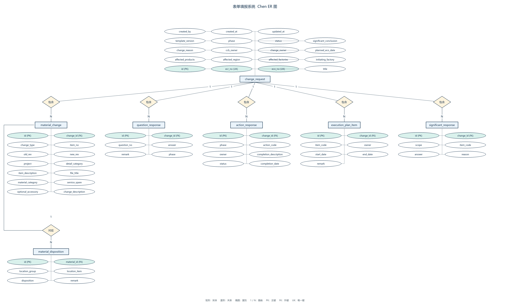
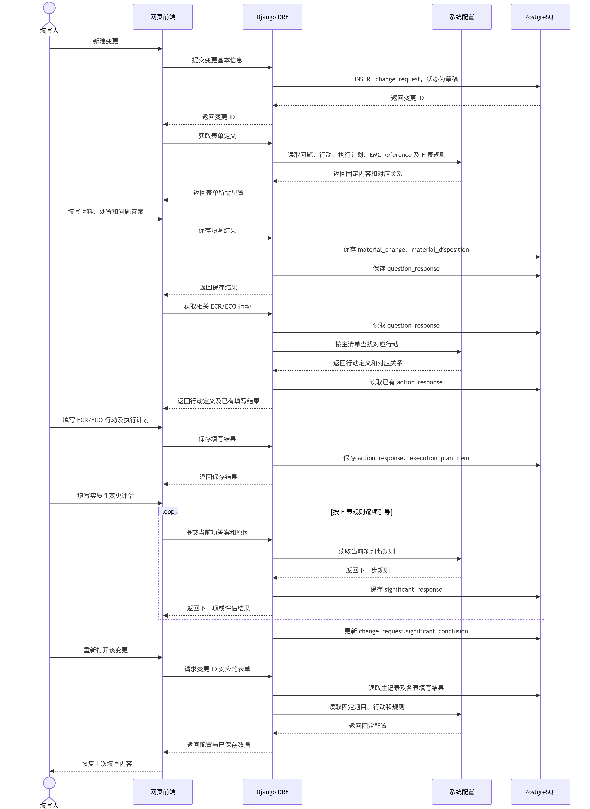

# 表单填报系统

面向公司内网电脑端的设计变更填报系统，将指定的八张 Excel 工作表逐步转为网页填报。技术栈：React、TypeScript、Vite、Ant Design、TanStack Query、Django REST Framework、MySQL 8.4。

## 当前进度

2026-10-08交付审查完成：本批日期、批准提示、统一入口、全局消息与持久已读确认1项P2并发缺陷，已修复旧已读请求覆盖新标记的问题。发布前150项MySQL全量、77项前端、lint/build及Django/迁移一致性通过。交付含0016，其他设备须备份并迁移后重启；本机账号、密码及数据不随Git同步。详见[审查与交付记录](docs/testing/CODE-REVIEW-DELIVERY-2026-10-08.md)，下方各批“未提交/待推送”等文字保留当时状态。

2026-10-08红点与已读已接入：收起时显示全局未读，展开后转到审核意见选项；单项/全部标为已读只清除提醒，待办保留，刷新及重登保持，新消息/轮次再提示。新增0016，本机备份后已应用；77项前端、148项MySQL全量及随后8项已读专项、lint/build与两种身份28组模拟页面检查通过。人工复验及提交/推送待完成，见[本批记录](docs/testing/INBOX-READ-2026-10-08.md)。

2026-10-08按用户确认补充登录后的全局审核提醒：审核意见、填写员回应及待审核申请均按本人权限汇总，首次有待处理事项弹窗，统一悬浮入口显示全局数量，列表页可直接打开消息及对应申请，取消跳转保留草稿。77项前端、40项真实MySQL受影响模块、lint/build及两种身份16组模拟页面回归通过，无新增迁移；本机服务已运行，人工复验及源码提交/推送待完成，见[本批记录](docs/testing/REVIEW-INBOX-2026-10-08.md)。

2026-10-08按页面注释合并系统反馈／审核意见为“意见与反馈”可拖动悬浮入口，展开后选原抽屉，保留未解决数量、草稿及切换保护；位置限制在视口内。76项前端、lint/build及独立模拟页面回归通过，用户复验待完成，尚未提交或推送，见[本批记录](docs/testing/FEEDBACK-LAUNCHER-2026-10-08.md)。

2026-10-08本地日期与审核说明修复：用户确认日期年份为2000～2100，区分不完整／不存在／超范围并阻止保存，保留日历及清空；后端同步范围校验，无新增迁移。审核按钮改为“本人同意批准”，显示批准人数、整单通过条件与禁用原因。76项前端、2项后端无数据库专项、lint/build及12组模拟组件回归通过；本机MySQL未连接，未做真实接口全量，公司首次灰色原因及人工验收仍待核实。当前修改尚未提交或推送，见[本批记录](docs/testing/DATE-AND-APPROVAL-2026-10-08.md)。

2026-10-08反馈Code Review三项P2已修复：最终取消离开不再清空反馈；同账号角色变化保留反馈草稿及未知请求；旧账号迟到权限响应不影响当前账号。前端72项、lint/build、12组真实反馈页面与6组模拟回归通过；无后端或迁移变更。证据见[本批记录](docs/testing/SYSTEM-FEEDBACK-2026-10-08.md#本轮-code-review-三项p2修复)。

最新验证：2026-10-08交付前复核139项真实MySQL、72项前端及lint/build通过；反馈12组真实页面及6组模拟回归、原审核／提交恢复回归已通过。本机业务表21张、176列，迁移至0015，原业务数据及账号关系保持。本批源码、迁移、回归脚本和文档随主分支交付；其他设备自行备份并迁移，人工业务验收及正式部署仍待完成。

2026-10-08独立系统反馈已接入：填写员／审核员在工作台及申请内均可提交“问题／建议／其他”，本人查看原文、状态和全部处理记录；“反馈管理员”是附加组权限，可通过独立入口回复、更新待处理／处理中／已关闭状态和说明后重新打开。新增0015及两张表，业务表共21张；不改变申请或审核状态，不提供附件、用户追问或消息通知。本机已备份并应用0015，其他设备须执行自己的备份／迁移。人工业务验收仍待完成；交付证据见[系统反馈记录](docs/testing/SYSTEM-FEEDBACK-2026-10-08.md)。

2026-10-08测试精简与补强完成：删除旧实现及重复覆盖、迁移必要场景到当前自动保存；共享ECR/ECO断言但保留两个接口验证；普通迁移改为非空夹具逐步升级链，补强实际SQL锁等待。完整129项MySQL和67项前端（合计196项）、lint/build及可重复浏览器回归通过。本机后端完整流程约44.4秒，测试结构与计时详见 [精简记录](docs/testing/TEST-CONSOLIDATION-2026-10-08.md)。本轮修改随本次提交同步，其他设备从main取得最新代码。

2026-10-08全项目复查后修复：审核员未发送意见及未知操作增加刷新／关闭保护；提交响应丢失但已退回时，查询按原UUID与轮次确认成功并解除导航锁。当前修复与回归结果见 [本轮记录](docs/testing/REVIEW-FIXES-2026-10-08.md)。本轮前端修复及文档更新随本次提交同步。

2026-10-05审核意见审查的三项P2已修复：未发送回应阻止重提、草稿绑定编辑时版本、终止状态查询解除未知操作导航锁。最新前端专项24项／全量84项、lint/build及6组隔离模拟页面检查通过；后端未改，137项MySQL保留为上一批结果。[修复及验证](docs/testing/REVIEW-ISSUES-2026-10-05.md#code-review-三项p2修复)。人工业务复验仍待完成。

2026-10-05最新交付：**逐条审核修改意见闭环已实现**，包含多条意见一次退回、填写员逐条回应、重提沿用审核安排、原提出者结合正文复核、跨轮保留及未解决项阻止批准。八表共用悬浮意见入口；旧普通留言停止新增并只读保留。最终137项真实MySQL、78项前端检查、lint/build及13组真实页面检查通过；0014已应用，临时数据已清理，原业务数据保持。人工业务验收仍待完成；独立系统反馈和管理员处理是下一批。见[交付与验证](docs/testing/REVIEW-ISSUES-2026-10-05.md)。以下各批结果为历史记录，不代表最新功能仍待实现。

2026-10-05审核界面调整：整单意见区明确说明跨页签共用；审核操作与信息区分隔，通过／退回在左、重新登录在右；审核员八表及抽屉中的只读文字改为深色、背景变浅，控件仍禁用。当前改动的审核专项4项、lint/build及12组隔离模拟页面检查通过；此前全量127项MySQL／76项前端保留为上一批证据，本次未重跑全量。没有修改后端或业务数据，见 [界面调整记录](docs/testing/REVIEW-READABILITY-2026-10-05.md)。

更新日期：2026-10-05。**“概述与物料处置”“问题评估”“ECR 评估行动”“ECO 执行”和“EMC 参考填写”及“执行计划”、实质性变更评估主表／子表的主要填写、保存与恢复链路已实现。受托 ECR 文字及联动保存恢复复核已完成，ECO 技术交付完成；指定八张工作表的主要填写链路已覆盖；提交、锁定、审核列表、批准、退回修订、按轮重提及反馈已实现，不代表完整业务验收或正式部署通过。**

| 已实现部分 | 当前行为 |
| --- | --- |
| 登录与申请列表 | 登录、退出、单账号单有效会话；本人草稿新建、查看和确认后永久删除 |
| 概述 | 11 个业务字段、草稿保存恢复、未保存提醒、底部下一页；非空 ECR/ECO 编号分别全局唯一，空编号可重复 |
| 物料与处置 | 升版、新增、停用三类物料；升版／停用在同一抽屉填写十个位置处置；类别筛选含不限，编辑／删除横向排列 |
| 问题评估 | 27 个固定问题按七个职能分组；未回答／是／否、备注、局部保存恢复；第 5／13／14 题选否且备注为空时提示，允许保存草稿；第 13 题保留一个综合回答 |
| 自动保存 | 八页实际修改停顿 2 秒保存；在途输入保留、有限重试；新物料首次创建手动确认 |
| 保存导航 | 概述／问题／执行计划／实质性评估页切换支持继续填写、放弃修改并切换、保存并切换；保存成功才跳转，失败保留输入；问题页顶部可直接保存 |
| ECR 评估 | 登录后的第四个页签；61 条固定行动按已保存问题联动，列表＋单条抽屉填写负责人、评估结果、状态及日期，真实保存恢复；旧填写不因答案改变而删除 |
| ECO 执行 | 第五个页签；61 条独立行动按已保存问题联动；负责人、行动完成情况、完成／不适用／在实施阶段完成状态及日期；ECR 下一页进入，真实保存恢复 |
| EMC 参考 | 第六页签；12类典型变更×11测试列，三层合并表头；本人草稿只填X／(X)／空白和说明，真实保存恢复；参考定义只读，有权审核员可在当前pending／approved轮次只读查看 |
| 执行计划 | EMC 后第七页签；源表 11 条固定活动、责任人／开始结束日期／备注；整页自动保存和恢复，日期顺序硬校验 |
| 实质性变更评估 | 执行计划后第八页签；七项主表、A～E抽屉共37题；原规则提示、组结论和最终结论人工填写，真实保存恢复；模板疑点明确标注 |
| 提交审核 | 第九页签；标题与ECR编号必填，指定至少一人或公开至少两名有效审核员；确认后待审批并锁定；重复请求去重，未知结果查询／原请求重试 |
| 业务身份 | Django原生“审核员”组，未加入为填写员；审核员工作台含指定／公开／退回沟通／已处理记录，只能读取有权当前表单，不能使用填写员写接口；超级用户不自动成为审核员 |
| 审核与退回 | 指定全部／公开两人通过；任一有权人员（含已个人通过者）可在整单待审核时填写原因退回；退回可修订、重提开启新轮，旧请求不能写新轮 |
| 意见与历史 | 正式修改意见逐条回应及原提出者复核；跨轮保留，未解决项禁批准；旧留言及退回原因只读保留，不提供完整旧表单快照 |
| 数据保护 | 账号隔离、预期账号检查、草稿／退回仅本人可编辑，待审核／批准只读、局部 PATCH、事务与申请行锁、新增 UUID 重试去重、级联删除 |
| 错误恢复 | 保存失败保留输入，旧会话失效支持原账号重登；后台读取失败不卸载编辑器；嵌套错误显示位置和原因 |

2026-10-05原开发设备的申请 #8（ECR-26010601）已按用户要求补录源表中的 33 条停用物料、330 个处置值、27 个问题答案及备注、31 条已填写 ECR 行动。ECR 其余 30 条保持空白，源表日期 2026.1.6 保存为 2026-01-06；未触发但已填写的行动保留。这是一次性样例填入，不是 Excel 导入功能；新申请仍为空，数据库和源 Excel 不随 Git 同步。 该样例不代表当前设备的数据。

最新技术复验（2026-10-05）：**127项真实MySQL、76项前端检查、lint/build、Django check及迁移一致性通过**。临时账号／申请已实际复验退回沟通、八表审核返回保护、填写保存与重开恢复、指定／公开批准、退回八表修订／新轮重提、反馈及权限隔离；延迟／丢响应为明确标注的浏览器注入。没有发现需要修改产品代码的缺陷；临时账号67～71、申请61～65及关联数据／会话已精确清理，原17张业务表、已有账号和组关系逐字段保持。用户人工业务验收仍待完成，见 [本轮复验记录](docs/testing/REVERIFICATION-2026-10-05.md)。此前审核审查修复的专项25项MySQL、16项前端及4项隔离模拟场景保留为历史证据，见 [修复记录](docs/testing/REVIEW-WORKFLOW-2026-10-05.md#本轮-code-review-修复)。

此前审核闭环交付检查记录：**125 项真实 MySQL 测试、76 项前端检查、lint/build 及迁移一致性通过**。本批审核专项新增11项、13组真实页面场景通过，0013已应用、原15张表及#8保持，两名保留审核员仍有效，见 [审核闭环](docs/testing/REVIEW-WORKFLOW-2026-10-05.md)。提交恢复的两项P2已修复，前端专项12项／全量72项及三组隔离界面时序通过，后端未改。交付时提交专项12项及17组真实页面复验通过，0012已应用、十四张旧业务表及#8保持，见 [提交与锁定](docs/testing/SUBMISSION-2026-10-04.md)。以下为此前各批独有验证证据。实质性评估首次读取完整性问题已修复，前端专项7项及全量59项通过；后端未改。交付时实质性评估专项8项、17组真实页面场景通过，源表七项主表／37题／74分支逐项一致；0011已应用、十一张旧业务表及申请#8保持，见 [交付记录](docs/testing/SIGNIFICANT-CHANGE-2026-10-04.md)。以下保存恢复及执行计划记录为此前各批独有证据。最新三项保存恢复审查问题已修复：物料刷新清空服务器删除格、异常保存响应保留输入、API 全阶段 30 秒期限及迟到响应保护。九组模拟和四组临时真实草稿回归通过，见 [修复记录](docs/testing/SAVE-RECOVERY-FIXES.md)；后端未改，94 项沿用刚完成的深入审查结果。本轮执行计划已接入并重新执行后端全量检查，14 组真实页面场景通过，见 [执行计划记录](docs/testing/EXECUTION-PLAN-2026-10-03.md)。此前六页自动保存已接入；真实临时草稿已复验六页保存恢复、在途输入、有限重试、条件备注、问题联动及账号／只读保护，见 [自动保存与业务复核](docs/testing/AUTOSAVE-BUSINESS-REVIEW-2026-10-03.md)。以下审查记录保留各批历史证据。两项早期审查问题已修复：不完整日期提示并阻止保存，明确清除才提交空日期；旧保存响应不覆盖新行动缓存或申请时间。此前四项状态同步问题也已修复，八组受控浏览器回归通过，见 [状态同步修复](docs/testing/STATE-SYNC-FIXES-2026-10-03.md)。最新三项审查问题已修复：概述／物料仅提交实际差异且保留未知结果重试；问题／ECR／ECO／EMC 保存后重新读取完整申请；干净物料抽屉同步新字段及处置，脏输入／保存中／待确认状态保持。十二组受控浏览器回归通过，见 [全项目审查及修复](docs/testing/FULL-CODE-REVIEW-2026-10-03.md)。EMC正式接入新增9项后端检查；演示检查替换为正式草稿检查，计数变化不表示业务断言被简单删除。独立 MySQL 测试库创建并销毁，接入时执行 16.223 秒；不把耗时当作固定保证。ECR 源表／主清单复核和 ECO 接入证据见 [本轮记录](docs/testing/ECR-ECO-2026-10-02.md)。ECR 干净抽屉刷新同步新字段和基线，脏输入／保存中／待确认状态仍受保护，见 [刷新修复](docs/testing/ECR-DRAWER-REFRESH-2026-10-02.md)。前端仍有包体积警告，该批次原设备已应用至 `0013_review_rounds`，当前迁移链至0014。真实接入验证见 [接入记录](docs/testing/ECR-INTEGRATION-2026-10-02.md)，技术检查不能代替业务复核。

[PR #1](https://github.com/jack1415926/form-filling-system/pull/1) 已合并到 `main`，合并提交 `3f62f00`。[PR #2](https://github.com/jack1415926/form-filling-system/pull/2) 已于 2026-10-03 合并，合并提交 `58224d5`，当时分支头为 `dd74f27`，包含此前问题评估、ECR、ECO、EMC 等交付。

**2026-10-08同步确认：主分支已包含审核意见闭环，合并基线为 `26c8168`（PR #3）。** 当前从main获取已合并功能，保留各设备配置，备份数据库并停写后应用全部未执行迁移至 `0014_review_issues`，重启前后端。恢复保护修复及测试整理随本次提交提供，其他设备从main取得最新代码。数据库、样例、凭据、原Excel与.local不随Git同步。操作方法见 [开发说明](docs/DEVELOPMENT.md#同步与迁移)。

原开发设备的2026-10-05运行快照见 [历史复验](docs/testing/REVERIFICATION-2026-10-05.md)。2026-10-08当前设备前端localhost:5173、后端127.0.0.1:8000，MySQL运行，迁移至0014；不据此推断其他设备的目录、端口或数据。启动和账号文件见 [开发说明](docs/DEVELOPMENT.md)。

## 下一步

已按选定的 A 版正式接入 [网站](http://localhost:5173/)：登录 → 打开申请 → ECR 评估，或从问题页下一页进入；有未保存内容可选择保存并切换。各批独有证据见 [接入记录](docs/testing/ECR-INTEGRATION-2026-10-02.md)、[保存导航](docs/testing/SAVE-AND-SWITCH-2026-10-02.md)和[刷新修复](docs/testing/ECR-DRAWER-REFRESH-2026-10-02.md)。迁移不预填答案；#8 的源表补录是后续用户要求的一次性操作，其他申请不预填。

独立 `?preview=ecr` 仍是明确标注的内存演示，不是正式数据入口；历史布局比较见 [预览记录](docs/testing/ECR-PREVIEW-2026-10-02.md)。正式与演示使用同一份固定行动定义。

ECR 默认筛选已按用户最新要求改为“当前触发”：只显示已保存问题回答为是的行动；否或未回答时隐藏，已有填写保留，可在“全部行动”查看。再次触发时恢复显示。

本轮 ECR 委托复核及 ECO 填写保存恢复交付已完成：正式网站登录 → 打开申请 → ECO 执行，或 ECR 下一页进入。ECR 与 ECO 都直接使用各自映射对应的已保存问题答案；默认当前触发，隐藏不删除，全部行动仍可查看。源表 ECO 填写区为空，#8 保留空白，不推测负责人或状态。执行计划已按用户选择追加在 EMC 后，实质性变更评估主表／子表现已接入第八页签；处置适用性、条件性备注及完整业务验收状态单独保留。

### EMC B版正式接入

已按用户选择接入[正式网站](http://localhost:5173/)：登录 → 打开本人申请 → EMC参考，或从ECO下一页进入。仅填写标记和说明，参考行列及表头只读。A版、角色下拉、演示申请、对照表和模拟保存已移除，`?preview=emc`不再是独立演示入口。首次实际保存才形成该申请的参考副本；查看不会创建数据，不预填标记。见[接入记录](docs/testing/EMC-INTEGRATION-2026-10-03.md)。

全站按三种业务角色划分：填写员填写并保存申请；审核员审查申请内容、判定是否通过；管理员维护需要填写的内容与规则。当前填写员填写／提交／修订和全站审核工作台、通过／退回／重提／反馈已接入，覆盖全部表单（包括EMC）；完整业务验收仍待完成；管理员规则维护暂不纳入 MVP。此前称作“EMC 管理员”的审查职责归入审核员，不单设 EMC 业务管理员。填写员不开放跨申请访问，审核员按当前轮次权限只读查看；定义修改未开放，超级用户同样受现有接口限制。

### 执行计划正式接入

已接入 EMC 后第七页签，或 EMC 下一页进入，上一页返回 EMC。五列表格直接填写；源表 11 条活动含“里程碑 9”固定只读，责任人／日期／备注初始空白，不复制样例到 #8。开始／结束精确到日，两端填写时结束不得早于开始，任一行日期错误暂停整页保存；此硬规则由用户本批确认。已有手动保存、自动保存、保存并切换、重开恢复和账号／只读保护。其他设备先备份、停写、应用 0010、重启后端再更新页面，见 [验证记录](docs/testing/EXECUTION-PLAN-2026-10-03.md)。执行计划及保存恢复功能已随后续合并进入main；同步后执行全部未应用迁移，当前至0014。

### 实质性变更评估正式接入

登录 → 打开本人申请 → 实质性变更评估，或执行计划下一页进入。主表第0项及A～E填写适用性／原因，A～E打开各组子表，共37题；抽屉与主表的人工组结论同步，F项及最终结论由人选择。改答不清空人工结论，显示复核提示；未回答不推导为否，不适用不删除旧填写。主表B提前结束公式、重复Chart B说明、C-2分组标题及缺少0.1～0.4参考清单均标注待业务确认。

实质性评估已纳入主分支。其他设备取得当前源码后先备份、停写、应用全部未执行迁移至0014，并重启后端后使用新版前端。原开发设备#8的补录范围属于历史数据，其他设备不自动复制。详见 [交付与验证](docs/testing/SIGNIFICANT-CHANGE-2026-10-04.md)。

### 提交审核与锁定正式接入

本人申请 → 第九页签“提交审核”，或实质性评估下一页。先填写标题与ECR编号；指定审核至少选一名审核员，公开审核至少存在两名有效审核员。方式和人员只留在当前页，正式确认后入库并锁定；重开查看提交方式、名单及时间。未知结果保留原请求，提供查询和原请求重试。审核员登录可从审核工作台处理本轮任务及反馈；退回后重提见下文审核闭环。

2026-10-08当前设备按用户要求配置三个填写员和三个审核员：填写员凭据只放在.local/applicant-accounts.json，审核员凭据只放在.local/reviewer-accounts.json，两个文件无账号交叉，均不提交Git。其他设备自行配置，不将技术超级用户自动当审核员。见 [开发说明](docs/DEVELOPMENT.md#提交批次升级与审核账号配置)。

### 审核、退回与按轮重提

审核员登录 → 指定给我的任务／公开审核／我的已处理记录 → 查看申请。当前有权轮可看八张表只读；个人通过后进入已处理记录，整单未结束时仍可退回。指定全部通过或公开两人通过才终结；退回原因必填。填写员只看本人申请，returned可修订并在第九页重提，默认沿用但可更改名单，新轮从零审核。

退回期间审核员仅看提交时基本信息、原因和意见，不看正在修改的整表。填写员须逐条回应正式意见，重提后由原提出者复核；旧普通留言只读保留。重提后的权限重新计算，旧审核员若未获新轮权限不能看新内容。各轮过程保留，不提供旧表单快照。功能代码已提交并推送，本轮技术复验完成；审核功能已合并；人工业务验收、模板疑点确认及正式部署仍待完成，管理员维护与导出不纳入MVP。见 [交付记录](docs/testing/REVIEW-WORKFLOW-2026-10-05.md)和 [本轮复验](docs/testing/REVERIFICATION-2026-10-05.md)。

### 待办

审核修改意见、申请内悬浮入口及独立系统反馈／管理员处理已完成技术实现；人工业务验收待完成。

- [x] 普通留言停止新增，旧记录只读保留；正式意见与处理事件单独保存。
- [x] 多条意见一次退回、逐条回应、重提后原提出者复核、未解决意见阻止批准、跨轮保留与原审核安排限制。
- [x] 申请内跨八表共用悬浮意见入口和未解决数量，草稿／退回正文隔离、请求恢复与未发送输入保护。
- [ ] 用户人工验收审核意见闭环和界面体验；技术结果见[本批记录](docs/testing/REVIEW-ISSUES-2026-10-05.md)。
- [x] 独立系统反馈：填写员／审核员工作台与申请内悬浮入口，类型＋文字，无附件；用户只看本人，管理员独立查看全部、回复并更新状态。
- [x] 类型为问题／建议／其他，状态为待处理／处理中／已关闭，管理员使用附加“反馈管理员”组；关闭与重新打开必须填写说明，完整处理历史公开给本人。
- [ ] 用户人工验收系统反馈及管理员处理体验。规则维护及导入／导出仍在范围外。

- [x] 自动保存：概述、已有物料及处置、问题、ECR、ECO、EMC、执行计划、实质性评估实际修改后停顿 2 秒保存，保存期间可继续输入，串行提交最新差异。网络／5xx／未确认结果失败后 5 秒、15 秒各重试一次，再失败等待手动重试；身份和权限错误暂停。保留手动保存及已有“保存并切换”，自动保存不关闭抽屉；新物料首次创建仍手动确认。没有本地持久化或异常退出恢复保证。详见 [验证记录](docs/testing/AUTOSAVE-BUSINESS-REVIEW-2026-10-03.md)。

本轮实际页面已复验三类物料的处置范围、六种处置及空白、局部清空，以及第 5／13／14 题条件性备注提示和草稿保存。后续已使用本机已有库完成原 `.xls` 的单元格、注释与数据验证只读补核：处置统一引用 T12:T17，允许空白；27 题题号、题干和职能逐题一致。原表未编码按类别／位置区分处置方式的额外限制，具体业务适用性仍待业务判断；不据此关闭完整业务验收。源文件哈希一致，申请 #8 与原业务数据未修改，详见上述记录。

MVP已按2026-10-05确认的退回／重提范围接入，技术交付与业务验收分别记录：

| 层级 | 待办 |
| --- | --- |
| 填写员 | 本人填写、指定／公开提交、审核进度、退回修订／新轮提交及逐条审核意见回应已实现；当前版本人工业务复验待完成 |
| 审核员 | 指定／公开／退回沟通／已处理列表、完整表单只读、批准／退回及轮次判定、反馈／过程历史已实现；当前版本业务复验待完成 |

指定审核至少选择一名审核员，所选人员全部批准后通过；公开审核无须选人，两名不同审核员批准后通过，重复批准只计一次。公开仅面向审核员，填写员不能看到其他人的申请。反馈可笼统记录意见、想法、疑问或说明，不分类、不作为批准、不改变状态；退回原因是独立必填操作，旧轮及批准后反馈只读。完整规则与验收见 [MVP](docs/MVP.md)。管理员对全站问题、填写内容与规则的维护、导出不纳入MVP。按小批交付。

本轮已完成退回沟通、审核返回保护和八表至批准终态的技术复验，见 [验证矩阵与边界](docs/testing/REVERIFICATION-2026-10-05.md)。下一步由用户按实际业务完成当前版本人工验收并收集体验；模板分支／处置及法规适用性确认、功能分支合并、其他设备代码／数据库同步和正式部署仍分别待完成。管理员维护、导入／导出等继续保持MVP排除边界，不自动开始下一批开发。

其他设备同步代码前，先保留自己的配置并备份数据库；迁移步骤见 [开发说明](docs/DEVELOPMENT.md#同步与迁移)。代码合并不等于数据库同步。

## 文档怎么读

| 文档 | 唯一主要职责 |
| --- | --- |
| 本 README | 当前已实现／未实现、最新验证、下一步入口 |
| [项目开发梳理](docs/PROJECT_GUIDE.md) | 帮助接手：代码地图、数据流、开发过程、日常流程与下一批边界 |
| [开发说明](docs/DEVELOPMENT.md) | 环境、启动、账号、迁移、检查命令 |
| [字段说明](docs/FIELD_MAP.md) | Excel 单元格和字段映射、条件与规则来源 |
| [MVP](docs/MVP.md) | 已确认总体需求、排除项及最终验收目标，不能当作完成清单 |
| [验证记录目录](docs/testing/) | 各批次独有证据、问题复现、修复和历史测试结果 |

优先阅读新梳理文档，不必从所有历史日志开始。验证记录按需要查阅：[阶段一](docs/testing/REVIEW-2026-09-30.md)、[物料及早期修复](docs/testing/MATERIALS-2026-10-01.md)、[删除及历史 AB 对照](docs/testing/DELETION-AB-2026-10-01.md)、[正式处置](docs/testing/DISPOSITIONS-2026-10-01.md)、[深入修复](docs/testing/REVIEW-FIXES-2026-10-02.md)、[测试精简](docs/testing/TEST-SIMPLIFICATION-2026-10-02.md)、[问题评估](docs/testing/QUESTIONS-2026-10-02.md)、[ECR 接入](docs/testing/ECR-INTEGRATION-2026-10-02.md)、[保存导航](docs/testing/SAVE-AND-SWITCH-2026-10-02.md)、[抽屉刷新](docs/testing/ECR-DRAWER-REFRESH-2026-10-02.md)、[ECR 复核与 ECO 接入](docs/testing/ECR-ECO-2026-10-02.md)。不把早期测试数量当作当前数量。

目录：`backend/`、`frontend/`、`scripts/` 为代码；`reference/` 和 `docs/testing/manual/` 为本机业务原件和人工反馈；`.local/`、`.venv/` 为本机配置、账号、备份、环境和验证产物，均不提交。

## 原始方案与设计图

[技术方案 1.4](docs/design/表单填报系统_技术方案1.4.docx)及原图保留。原方案中的 PostgreSQL、模板版本等历史设计以 MVP 的当前边界为准；图中实体不代表全部已经建表。审批和留言设计以 MVP 为准。

