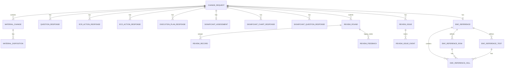
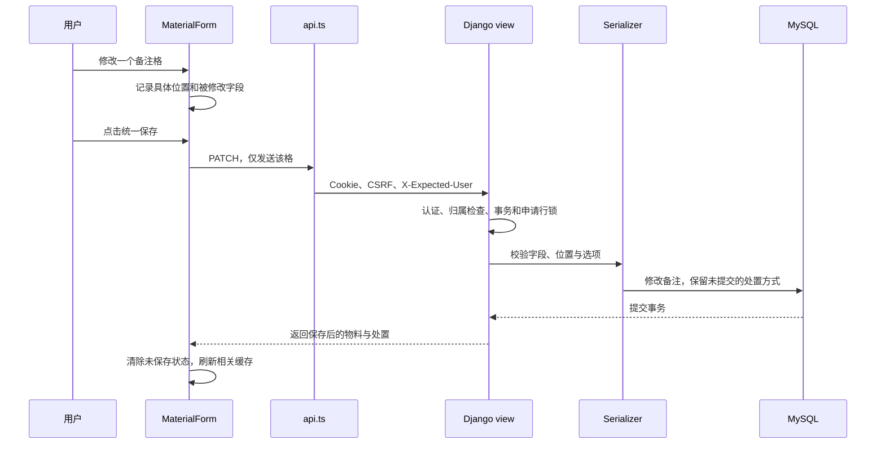

# 项目开发梳理：进度、过程与开发流程

更新日期：2026-10-05。面向需要逐步接手项目的人。本文解释“系统如何工作、为什么这样设计、以后怎么改”，当前状态以 [README](../README.md) 为汇总入口，具体字段以 [字段说明](FIELD_MAP.md) 为准。

最新交付：审核修改意见闭环和申请内跨八表悬浮入口已实现；原提出者复核、未解决项禁批准、逐条回应及审核安排限制均由后端校验。旧普通留言只读保留。0014新增两张意见表，137项真实MySQL、78项前端及13组真实页面检查通过，人工业务验收待完成。下一批为独立系统反馈及管理员处理；[本批记录](testing/REVIEW-ISSUES-2026-10-05.md)和[MVP当前范围](MVP.md#2026-10-05-审核意见与系统反馈)为当前依据，下文原审核批次描述保留历史。

## 建议的阅读顺序

1. 先看 README，分清已经实现、尚未实现和待复核的内容。
2. 阅读本文的业务流程、代码地图和保存流程；能顺着一次点击找到数据库写入位置即可。
3. 按 [开发说明](DEVELOPMENT.md) 启动，创建自己的练习草稿，不拿正式样例做删除练习。
4. 对照字段说明与源 Excel，理解一个字段的名称、类型及所属表。
5. 修改功能时查对应代码与测试；遇到某个历史问题，再打开相关验证记录。无需一开始读完全部日志。

## 业务上目前走到了哪里

目标是把指定八张表的内容搬到网页，最终支持多人并行审批和留言；完整目标在 [MVP](MVP.md)。当前“概述与物料处置”“问题评估”“ECR 评估行动”和“ECO 执行”和“EMC参考填写”及“执行计划”、实质性变更评估主表／子表的主要填写链路已落地。ECR 委托复核和 ECO 技术交付完成，完整业务验收仍待完成。

当前操作：登录 → 我的申请 → 新建／打开草稿 → 填写概述 → 物料及处置 → 问题评估 → ECR 评估 → ECO 执行 → EMC参考 → 执行计划 → 实质性变更评估 → 保存 → 重开恢复。

**八个网页页签对应八张 Excel 表。** 概述与物料拆为两页；实质性评估主表／子表合为一个页签和分组抽屉。 概述与物料明细属于同一张原工作表，“问题评估”对应第二张“问题”表，第四页签对应第三张 ECR 表，第五页签对应第四张 ECO 表，第六页签对应EMC reference，第七页签对应设计变更执行计划；本次按用户选择追加在 EMC 后。

原业务主线是概述与物料 → 问题筛查 → ECR 评估 → 执行计划 → ECO 执行确认；EMC 参考和实质性变更评估按适用条件参与。不能把 ECR 评估完成当作 ECO 行动完成，也不能自动代替人的法规结论。

Model采用draft／pending／returned／approved四个状态，提交、批准、退回、反馈及轮次接口均已接入。网页新建的是草稿；第九页提交后进入待审批并锁定，审核工作台、批准、退回和反馈已接入，业务验收待完成。

2026-10-04范围确认及2026-10-05审核闭环接入：填写员只能查看本人申请，提交时可选指定或公开审核。指定模式至少选一名审核员，全部所选人员批准后通过；公开模式不选人，两名不同审核员批准后通过，公开列表仅对审核员开放。反馈初版为申请内自由文字，可写意见、想法、疑问或说明，不分类、不作为批准或自动改变状态；待审批时申请者及有权审核本单的人可追加，批准后只读。提交、锁定、两种模式审核／退回及反馈均已接入，轮次与退回期间权限按2026-10-05确认执行。完整需求和验收以MVP为准，已实现范围见README。

业务角色按全站划分为填写员、审核员和管理员。当前已交付填写员填写、提交及锁定，以及审核员工作台；审核员审查内容并判定是否通过，覆盖所有工作表（包括 EMC），纳入当前MVP，本批审核列表、批准／退回和反馈已接入，完整业务验收待完成。管理员负责维护需要填写的内容与规则，暂不纳入 MVP。此前 EMC 的审查职责归入审核员，Django 管理后台与超级用户不等于业务管理员功能。范围见 [MVP](MVP.md#业务角色与-mvp-范围)。

当前本机样例：申请 #8，ECR-26010601，包含源表概述、33 条停用物料、330 个处置值，以及一次性补录的27题和31条ECR填写。用户后续可以继续修改，原Excel不是实时同步源。新草稿仍为空；没有通用导入功能，样例不会随 Git 克隆到别的设备。

2026-10-05只读核验远端：功能分支 `codex/enforce-unique-change-numbers` 与本地HEAD均为 `1ea9ff2`，main为 `58224d5`，最新功能尚未合并。`1ea9ff2` 包含实质性评估、提交与审核闭环及审查修复；此前 `69ad8e7` 包含自动保存、执行计划等较早交付，不能只同步它获得最新功能。本机数据库迁移至0013，其他设备代码同步后仍须自行执行未应用迁移。审核闭环交付时125项MySQL／76项前端、修复专项25项MySQL／16项前端与4项隔离模拟场景保留为历史证据；本轮重跑127项真实MySQL、76项前端、lint/build及迁移一致性通过，八表填写恢复、审核／退回重提与反馈技术复验完成，见 [本轮记录](testing/REVERIFICATION-2026-10-05.md)。本轮只修改文档，没有产品代码修复、提交、推送或合并；人工业务验收及正式部署仍待完成。

## 先理解十九个业务表



| 实际表 | 保存什么 | 为什么分开 |
| --- | --- | --- |
| change_request | 申请者、状态、概述、ECR/ECO编号、审核方式及时间 | 一项申请只有一份概述 |
| material_change | 三类物料、料号、版本、描述、分类、标记及变更内容 | 一项申请可以有很多条物料 |
| material_disposition | 物料关联、位置分组、具体位置、处置方式及备注 | 同一物料在不同位置有不同处理方式 |
| question_response | 申请关联、题号、回答和备注 | 固定题干统一配置，每项申请仅保存填写结果 |
| ecr_action_response | 申请、稳定行动标识、负责人、结果、状态及日期 | 一题可对应多条行动，固定文字共用配置，不在申请中重复存储 |
| eco_action_response | 申请、独立行动标识、负责人、完成情况、状态及日期 | 使用 ECO 自己的映射，多一个在实施阶段完成状态，与 ECR 分开保存 |
| execution_plan_response | 固定活动对应的责任人、开始／结束日期及备注 | 每单只保存填写，不重复活动文字 |
| review_round | 每轮方式、提交时基本信息、状态及退回原因 | 不复制完整表单，隔离新旧轮 |
| review_record | 本轮指定人员及实际个人批准时间 | 按轮唯一，旧批准不计入新轮 |
| review_feedback | 旧普通留言作者、时间及文字 | 历史只读保留，不再新增 |
| review_issue | 申请、来源轮次、原提出者、页签、定位、问题、状态和版本 | 未解决项跨轮保留，独立于批准票数 |
| review_issue_event | 意见处理及请求确认记录 | 追加历史，UUID及版本保护重试和迟到动作 |
| significant_assessment | 本单F项与人工最终结论 | 与组结论和逐题提示分开保存 |
| significant_chart_response | 第0项及A～E适用性、原因、人工组结论 | 主表与抽屉编辑同一字段 |
| significant_question_response | 37题回答及原因 | 稳定题号对应固定定义和分支 |
| emc_reference | 本单参考标题、介绍、图例和定义 | 首次实际保存形成副本，当前只读 |
| emc_reference_row | 典型变更文字、稳定键及顺序 | 一项参考有多行，当前填写者不能改定义 |
| emc_reference_test | 测试名称、分组、标准引用、稳定键及顺序 | 一项参考有多个测试列 |
| emc_reference_cell | 所属参考、行和测试、标记及说明 | 只保存非空格，复合外键保证行列归属 |

物料／位置组合唯一；三大分组不是三张表。网页的十个位置都能显示，但只有填了处置或备注的位置才需要一条记录；两个格都清空时删除该位置记录。“未填写”和明确选择 NA 是不同数据。

编号和版本用文本保存，避免 `000003151` 变成数字后丢失前导零。ECR 与 ECO 分别全局唯一，空编号允许多个；物料号没有全局唯一规则，不能用它判断一次新增是否重复。

申请删除会通过外键级联删除物料、处置、问题回答、ECR／ECO 填写、EMC 参考、执行计划及实质性评估填写；只允许本人草稿，操作不可恢复。Django 的用户和会话表属于系统表，和这十九个业务表职责不同。

### Model、migration、serializer 各负责什么

- **Model**：数据库里有哪些字段、外键和约束，见 [models.py](../backend/changes/models.py)。
- **migration**：如何把数据库升级成 Model 所描述的结构。只改 Python 文件不会自动给已有数据库加列或建表。
- **serializer**：HTTP 输入是否合法、哪些字段能改、怎样把对象转为 JSON，见 [serializers.py](../backend/changes/serializers.py)。接口校验不能替代数据库唯一约束。
- **view**：谁能访问、申请状态是否允许操作、什么时候开启事务和拿行锁，见 [views.py](../backend/changes/views.py)。

当前迁移链：0001 申请表 → 0002 编号唯一 → 0003 物料表 → 0004 新增请求 UUID → 0005 处置表 → 0006 问题回答表 → 0007 ECR 行动填写表 → 0008 ECO 行动填写表 → 0009 EMC四表 → 0010 执行计划填写表 → 0011 实质性评估三表 → 0012 提交字段及审核关联 → 0013 审核轮次／退回／反馈。不同设备必须执行各自的迁移；Git 同步不包含数据库升级。

## 代码地图：想改什么，先找哪里

| 位置 | 入口与职责 |
| --- | --- |
| [frontend/src/main.tsx](../frontend/src/main.tsx) | 启动 React、提供 TanStack Query；当前查询缓存新鲜期 30 秒 |
| [frontend/src/App.tsx](../frontend/src/App.tsx) | Login；Workspace 识别登录状态；UserWorkspace 管理当前账号的列表；ChangeEditor 管理页签与离开提醒；OverviewEditor 编辑概述 |
| [frontend/src/MaterialEditor.tsx](../frontend/src/MaterialEditor.tsx) | 物料列表、筛选、新增／编辑／删除；内部 MaterialForm 管理表单、局部修改及统一保存 |
| [frontend/src/DispositionFields.tsx](../frontend/src/DispositionFields.tsx) | 三组十位置的处置控件，不直接发请求 |
| [frontend/src/QuestionEditor.tsx](../frontend/src/QuestionEditor.tsx) | 七组问题表格、局部保存、基线对比、失败与刷新保护 |
| [frontend/src/EcrEditor.tsx](../frontend/src/EcrEditor.tsx)／[EcoEditor.tsx](../frontend/src/EcoEditor.tsx) | 正式 ECR／ECO 列表与单条抽屉，使用共享保存队列；固定行动定义各自独立 |
| [frontend/src/ExecutionPlanEditor.tsx](../frontend/src/ExecutionPlanEditor.tsx)／[executionPlanDraft.ts](../frontend/src/executionPlanDraft.ts) | 第七页五列表格、稳定活动字段映射、日期完整性与顺序校验 |
| [frontend/src/SignificantChangeEditor.tsx](../frontend/src/SignificantChangeEditor.tsx)／[significantChangeDraft.ts](../frontend/src/significantChangeDraft.ts) | 第八页主表与分组抽屉共用草稿、人工结论及稳定题号映射 |
| [backend/changes/significant_change_views.py](../backend/changes/significant_change_views.py)／[固定定义](../backend/changes/significant_change.json) | 七项主表、37题及分支来源；三块局部PATCH与事务保护 |
| [frontend/src/useAutosave.ts](../frontend/src/useAutosave.ts)／[autosave.ts](../frontend/src/autosave.ts) | 2秒停顿、串行请求、手动等待、有限重试、字段修改序号与未知结果保护 |
| [frontend/src/materialSave.ts](../frontend/src/materialSave.ts) | 物料响应身份／字段校验及完整显示快照；清空删除格但不扩大 PATCH |
| [frontend/src/SaveBeforeSwitch.tsx](../frontend/src/SaveBeforeSwitch.tsx) | 保存并切换确认；保存成功才导航，等待时互斥，失败保留当前页 |
| [frontend/src/api.ts](../frontend/src/api.ts) | TypeScript 数据类型、当前 Cookie 的 CSRF、预期账号头、30秒全阶段请求期限、错误转换和身份变化事件 |
| [backend/changes/execution_plan.py](../backend/changes/execution_plan.py)／[execution_plan_views.py](../backend/changes/execution_plan_views.py) | 11条固定活动及整批计划校验／保存；事务内合并既有日期，不预填样例 |
| [backend/backend/urls.py](../backend/backend/urls.py) | URL 对应哪个处理函数或 view |
| [backend/backend/settings.py](../backend/backend/settings.py) | MySQL、SessionAuthentication、默认权限、本机环境变量 |
| [backend/changes/permissions.py](../backend/changes/permissions.py) | 检查页面预期账号与当前认证账号是否一致；不授予额外权限 |
| [backend/changes/dispositions.py](../backend/changes/dispositions.py) | 后端固定位置和处置选项 |
| [backend/changes/questions.py](../backend/changes/questions.py) | 后端固定题号、题干、职能和条件性理由提示 |
| [backend/changes/ecr_actions.json](../backend/changes/ecr_actions.json)／[ecr.py](../backend/changes/ecr.py) | 61 条固定行动、来源问题和职能；后端与演示共用定义 |
| [backend/changes/signals.py](../backend/changes/signals.py) | 登录后使同账号的旧数据库会话失效；由 apps.py 注册 |
| [scripts/backend.ps1](../scripts/backend.ps1) | 加载本机配置并调用 manage.py，启动或执行检查 |

目前没有前端路由框架：页签与选中申请由 React 状态管理，刷新通常回到“我的申请”。也没有通用动态表单平台、规则引擎或独立审批服务。

## 一次保存怎样到达数据库

以“把公司库存成品的备注清空，但保留 NA”为例：



开发时由 Vite 把 `/api` 请求代理到 Django，本机为 8001，共享默认 8000。代理配置仅用于开发；正式部署尚未验收。

传输示例：

```json
{"dispositions":{"company_finished":{"remark":""}}}
```

空字符串表示清空；没有提交的 `disposition` 和其他位置保持不变。不能把整份旧表单重新发送，否则可能覆盖另一个窗口刚保存的字段。基础物料与处置在一个事务内保存，后半段失败时前半段也回滚。

### 三个容易混淆的保护

| 机制 | 解决的问题 | 不解决什么 |
| --- | --- | --- |
| 认证及所属申请过滤 | 当前登录用户只能访问自己的申请 | 不能单凭缓存知道另一个窗口刚换了账号 |
| X-Expected-User | 当前 Cookie 账号和页面预期账号不同就拒绝操作、刷新身份 | 该头不是密码或授权凭据，旧客户端未传时保留原认证行为 |
| UUID request_id | 同一新增抽屉失败重试返回原记录，不重复建行 | 不按料号去重；不能代替业务编号规则 |

同一个 UUID 重试的内容如果不同，后端返回 409，不静默覆盖原记录。读取物料和处置也使用申请行锁，避免两次查询间插入保存而混合不同版本。

同一字段同时修改仍以后保存为准，没有版本冲突检测；不同字段通过局部 PATCH 尽量保留。失败保留输入与自动保存分别处理；自动保存失败仍保留当前输入，不代表已写入数据库。API 的30秒总期限覆盖CSRF获取、主请求和正文读取，超时写入按结果未确认处理，不能认为服务器未写入。物料成功响应先验证身份和字段结构，再更新缓存／基线；干净同步显式清除服务器删除格，PATCH仍只发送差异。详见 [保存恢复修复](testing/SAVE-RECOVERY-FIXES.md)。

也要区分三种数据位置：Form／React state 是正在填写的内容，TanStack Query 缓存是最近读到的服务器结果，MySQL 才是持久化数据。刷新会重新建立前端状态，需要重开申请读取数据库；未保存提醒不是备份。有时服务器已经保存但响应丢失，因此新增不能只靠“再次点击保存”，还需要稳定 UUID 防止重复建行。

## 开发过程：每一批解决了什么

下表是过程索引，不重复完整测试日志；日期按本项目记录的批次划分。

| 批次 | 实质交付或发现 | 原因与证据入口 |
| --- | --- | --- |
| 概述草稿及编号规则 | 登录、概述保存恢复、单会话、编号约束 | 先做能独立验证的一小段；[阶段一记录](testing/REVIEW-2026-09-30.md) |
| 三类物料 | 列表＋单条抽屉，基础物料保存恢复 | 库存处置明确另做，不能说整张表完成；[物料记录](testing/MATERIALS-2026-10-01.md) |
| 早期审查修复 | 后台读取失败丢输入、会话失效、换账号缓存、重复新增 | 保存成功响应丢失不等于服务器未保存；同账号重登要保留草稿 |
| 草稿删除及布局对照 | 草稿级联删除，处置 A/B 内存原型 | 先验证使用方式，再由用户选定同一抽屉布局；[删除及对照记录](testing/DELETION-AB-2026-10-01.md) |
| 正式处置接入 | 建处置表，统一保存，原型退出正式流程 | 布局选择不是持久化完成；[处置记录](testing/DISPOSITIONS-2026-10-01.md) |
| 本机 Excel 补录 | #8 的 33 条停用物料与 330 个处置值 | 保留原表文字和前导零，不修改概述或其他申请，不开发通用导入 |
| 深入审查修复 | 旧窗口写入错误账号、混合版本读取、嵌套错误乱码式展示 | 后端检查预期账号；读取也串行；递归错误保留路径；[修复记录](testing/REVIEW-FIXES-2026-10-02.md) |
| 测试精简 | 53 个方法合为 51 个，复用公共用户、仅测试快速哈希 | 保留业务断言，减少准备成本；[计时对照](testing/TEST-SIMPLIFICATION-2026-10-02.md) |
| GitHub 合并 | 功能提交 356d590；PR #1 合并提交 3f62f00 | main 已含上述代码；合并不代表数据库同步、业务验收或生产部署 |
| 问题评估 | 27 题、七个职能分组、局部保存恢复及条件提示 | 第 13 题保留综合回答，理由缺失不阻断草稿；[问题页验证](testing/QUESTIONS-2026-10-02.md)；分支交付及 main 合并状态见 README |
| ECR 布局选择及接入 | A/B 比较后选 A，加入真实数据库与第四页签 | 布局选择和数据库接入分别验证；[预览历史](testing/ECR-PREVIEW-2026-10-02.md)、[正式接入](testing/ECR-INTEGRATION-2026-10-02.md) |
| 两页源表补录与筛选调整 | #8 补录27题与31条ECR；默认仅当前触发 | 未触发时隐藏但保留内容，全部行动仍可查看；日期／状态保留源含义 |
| 保存导航与顶部保存 | 概述／问题页保存并切换；问题页顶部保存 | 不增加自动保存；[导航验证](testing/SAVE-AND-SWITCH-2026-10-02.md) |
| ECR 抽屉刷新修复 | 干净抽屉与列表一致，脏表单保留原基线 | 部分更新不把旧负责人误当成修改；[刷新验证](testing/ECR-DRAWER-REFRESH-2026-10-02.md) |
| 自动保存与源表补核 | 共享串行保存、在途输入、有限重试；处置定义／注释和27题重新核对 | [本批证据](testing/AUTOSAVE-BUSINESS-REVIEW-2026-10-03.md) |
| 执行计划 | EMC后第七页、11条活动、五列表格、日期顺序硬校验及真实恢复 | 用户选择的日期规则；[交付记录](testing/EXECUTION-PLAN-2026-10-03.md) |
| 最新保存恢复修复 | 删除格不重写、物料异常响应保留输入、30秒期限与迟到保护 | 九组模拟、四组真实回归；[记录](testing/SAVE-RECOVERY-FIXES.md) |
| 实质性变更评估 | 第八页签、主表＋五组37题、人工结论、真实恢复 | 原模板疑点保留并标注；[交付记录](testing/SIGNIFICANT-CHANGE-2026-10-04.md)；随本次审核闭环一并纳入Git提交 |
| 当前GitHub状态 | 最新功能及审核修复提交1ea9ff2已推送功能分支 | 2026-10-05只读核验main仍58224d5；本轮复验文档未提交／推送，业务验收与正式部署未关闭 |

历史日志中各批测试数量都是当时结果，不是互相矛盾。当前计数以 README 为准；问题页新增10项后端测试，ECR新增7项，EMC接入时后端86项、前端22项；EMC新增9项后端，旧演示6项前端替换为正式草稿4项，其他断言保留；历史计数保留。

## 日常开发流程：一次只完成一小批

1. **先定边界**：写清用户要新增什么、什么不做、怎样验证。避免“顺便把剩下 MVP 全补齐”。
2. **核对原表与现有代码**：题目、字段、合并单元格、条件规则及已有数据分别检查，不直接复制样例作为默认值。
3. **确定数据与接口**：哪些是业务字段，哪些由系统控制；空白与否／NA 是否不同；唯一性、归属和删除关系是什么。
4. **实现后端与迁移**：先处理输入校验、权限、事务及约束；迁移前保留设备配置、备份并停写，具体命令只维护在开发说明。
5. **实现页面闭环**：填写 → 保存 → 重开；同时处理未保存离开、失败保留输入、请求期间互斥和缓存刷新。
6. **按影响验证**：先运行受影响测试，再做针对性页面回归；一批交付／合并前跑全量。真实 MySQL、静态检查和浏览器验证不能互相冒充。
7. **审查并修复**：用独立测试账号复现，不操作真实样例；必须区分产品问题与自动化工具的动画／定位问题。
8. **更新文档、提交与合并**：README 更新现状，字段说明更新映射，验证记录保存独有证据；按用户授权提交／推送／合并，不上传凭据或数据库。

运行方法统一见 [开发说明](DEVELOPMENT.md)。当前测试在独立 `test_form_system` 中运行后销毁，不在开发库上做破坏性测试；MD5 快速哈希只覆盖功能测试类，生产仍使用默认强哈希。

### 自己读懂项目的三个练习

- **追一个字段**：在副本草稿修改标题，依次找到 OverviewEditor、api.ts、ChangeDetail、ChangeRequestSerializer、ChangeRequest.title，解释每一层做了什么。
- **追一个处置格**：只清空备注，在浏览器 Network 看 PATCH 是否只含 remark，再解释为什么 NA 没有被覆盖。
- **追一个拒绝**：用另一个独立测试账号请求不属于自己的申请，核对状态码；不要只看前端按钮是否隐藏。

出现问题先记录申请 ID、操作顺序、预期／实际结果和 HTTP 状态。查看请求时不要把 Cookie、密码或本机配置贴入公开 PR。

## 问题评估（已实现，待业务复核）

本批已实现闭环：打开申请 → 回答 27 题并填备注 → 保存 → 刷新／重开／重登恢复。技术验证见 [验证记录](testing/QUESTIONS-2026-10-02.md)，人工复核待完成。

| 内容 | 实现边界 |
| --- | --- |
| 固定内容 | 按原 Excel 职能分组显示题号和完整题干；不引入动态表单框架 |
| 可填写内容 | 未回答／是／否和备注；未回答不能自动转成否；草稿可暂不填完整 |
| 条件提示 | 第 5、13、14 题选否且备注为空时提示说明理由，允许保存草稿；第 13 题不拆分 |
| 数据设计 | 沿用原设计的 question_response，与申请关联；题号、回答、备注，同申请／题号唯一；题干与职能固定配置，不逐申请重复存储 |
| 导航 | 物料下一页到问题，问题上一页／下一页连接物料及真实ECR；概述和问题可保存并切换，问题顶部及底部都能保存 |
| 保护 | 沿用预期账号、本人申请、非草稿只读、局部保存、申请锁、级联删除及失败保留输入 |
| 不做 | ECR/ECO 行动生成、执行计划、EMC／F 页面、审批、留言、导出、模板版本及通用规则引擎 |

27 个稳定题号、题干、职能及提示映射已直接对照源表；新申请全部未回答，原实例的“否”与备注不是默认值。原表位置及接口结构见 [字段说明](FIELD_MAP.md#问题表已实现待业务复核)。

页面只发送与已保存基线不同的题和字段，改回原值不再标记未保存。读取刷新不覆盖脏表单，较旧的读取结果也不能覆盖新保存的基线。同账号重登刷新问题缓存但保留输入，切换账号关闭原编辑器；申请删除时移除问题缓存。失败或 404 保留输入，不自动创建替代申请。现已接入停顿 2 秒自动保存；并发版本冲突处理仍未实现。

验收点：题目完整、三种回答状态有区别、备注正确恢复、单题改动不覆盖其他题、其他账号不能访问、非草稿不能修改、失败保留输入。27 题不需要机械增加 27 个测试方法，可用一项完整性检查加有意义的参数化场景；独立的权限／事务回归不能因此删除。

ECR 已按选定的 A 版正式接入，早期技术验证见 [接入记录](testing/ECR-INTEGRATION-2026-10-02.md)；本轮已按用户委托完成文字、联动和保存恢复复核，ECO 也已正式接入，见下文及 README。不要把问题回答为否直接解释成删除已填行动。

## ECR 当前规则与后续待办

正式页只使用已保存的问题答案。默认“当前触发”仅显示回答是的行动，否／未回答隐藏，不删除填写；全部行动可查看和编辑。每条固定行动有独立稳定标识，一题对应多条，不能按题号去重。负责人是业务文字，评估结果、完成／不适用状态及日期由人填写，不自动执行题干中的审批或法规步骤。

干净抽屉在重登／读取刷新后同步最新字段及基线；未保存、保存中、结果未确认时保持输入和原基线。源表补录不属于通用导入。独立预览仍是内存演示，正式登录后的第四页签才会写数据库。

本轮 ECR 源字段与主清单、联动和保存恢复已完成受托复核，ECO 已一次性接入真实保存恢复。第五页签和独立 `EcoEditor.tsx`／`ecoDraft.ts` 沿用 ECR 的交互与保护，问题保存同时刷新两页，重登和删除处理两页缓存。ECO 不依赖 ECR 的完成状态；源表文字中的审批／法规动作仍由人执行，不自动产生审批任务。证据见 [本轮记录](testing/ECR-ECO-2026-10-02.md)。该ECO交付批次当时剩余审批与留言；当前已由后续审核闭环批次接入，业务验收待完成。八页自动保存已按确认规则接入，使用共享串行调度与字段修改序号保护；新物料首次创建仍手动确认。保存时机、有限重试及本轮业务复核边界见 [记录](testing/AUTOSAVE-BUSINESS-REVIEW-2026-10-03.md)，不将未保存提醒当作异常退出恢复。

## 执行计划（已接入）

按用户选择追加在 EMC 后，以五列表格直接填写 11 条固定活动，含“里程碑 9”。新申请和 #8 不复制样例负责人；日期精确到日，两端填写时结束不得早于开始，任一行不完整日期或顺序错误阻止整页保存。复用自动保存、局部 PATCH、未知结果重试、原账号重登和非草稿保护，活动不自动执行审批或法规操作。模型／接口及实际验证见 [本批记录](testing/EXECUTION-PLAN-2026-10-03.md)。

## 以后怎样维护这些文档

- README 只更新当前汇总，不再连续追加每一轮耗时和修复全文。
- 本文追加重要交付及设计变化；细节已有证据链接时不再次复制日志。
- DEVELOPMENT 维护可执行步骤，FIELD_MAP 维护源字段，MVP 维护总体需求；修改一项事实时先确定应由哪个文件负责。
- testing 下的记录是历史证据：保留独有复现、迁移、计时和限制，不因历史数字不同而删掉。新结论更新汇总并指向新记录。
- 问题清单要区分“已实现／已验证／待人工复核／待开发”；代码合并不能自动关闭业务验收。

## EMC正式填写与待办

EmcEditor在登录后的第六页签展示固定定义、三层表头和交叉格填写。关闭单行抽屉保留页面草稿，可连续填写多行再保存；客户端仅提交相对于保存基线改变的格和字段。网络结果未确认时仍能按当前值重试，原账号重登保留脏输入，读取失败不卸载已打开编辑器。旧保存响应不退回新缓存。

emc_reference与申请一对一，行、测试列、格三表归属于该参考，共四张表；格还指向行与列，复合外键保证同一参考。首次实际保存复制本单定义并创建非空格，GET不创建记录；删除申请级联，清空格不删定义。

后端emc_views.py写入仅允许本人草稿／退回申请，先整批校验再锁申请事务保存；当前读取也允许有权审核员查看pending／approved当前轮次。定义和角色字段拒绝，不因超级用户身份开放维护。EMC审查已接入全站审核员按轮权限；管理员参考定义与规则维护暂不纳入MVP，不添加客户端角色选择器。[正式接入验证](testing/EMC-INTEGRATION-2026-10-03.md)与[历史演示](testing/EMC-PREVIEW-2026-10-03.md)分开保存。

## 实质性变更评估：主表与分组抽屉

第八页签在执行计划后，主表七项，第0项及A～E填写适用性与原因，F项和最终结论人工填写；A～E抽屉共37题。后台significant_change.json是固定定义和分支来源，significant_change_views.py提供三块局部PATCH；前端SignificantChangeEditor与significantChangeDraft复用共享队列，主表和抽屉共用一份组结论。内部标识如sub_b_1_1不含点号，展示仍为B-1.1。

原模板的逐题结果是提示，不自动设置人工结论。改答后保留结论并提示复核，不适用不删除填写，关闭抽屉保留草稿。三张新表关联申请、唯一与合法值约束、空值清理及申请行锁事务与既有模块一致；GET不写库，保存刷新完整申请，原账号重登保留输入，切换账号和删除处理新缓存。已标注B提前结束、重复Chart B说明、C-2标题及缺少0.1～0.4清单的疑点，业务确认单独保留。

本机0011已应用，十一张旧业务表逐字段一致，#8未预填；技术检查及17组真实页面复验见 [交付记录](testing/SIGNIFICANT-CHANGE-2026-10-04.md)。该实质性评估交付批次当时不含审批／留言；当前已接入审核及反馈，完整业务验收仍待完成。

## 用户提交与锁定

第九页SubmissionEditor使用独立GET／POST提交接口与有效审核员名单。当前填写页保存或明确放弃后进入，EMC补齐现有SaveHandle；抽屉打开／请求在途不能切换。选择仅保留页面，最终确认才入库。后端submission_views事务锁申请、校验已保存标题／ECR、角色及审核员，写方式／名单／时间并转pending；所有原写入口继续按同一申请锁与状态拒绝修改。

roles使用原生审核员组，FillerPermission统一限制本批DRF业务接口；user响应含role，审核员登录进入审核工作台。提交POST幂等，原载荷重复返回既有结果，不同方式／名单冲突；未知结果冻结原请求并提供查询／重试，响应在缓存前校验完整性与身份，旧响应不能解除锁定。成功刷新完整申请、列表及填写缓存。

0012已应用，十四张原表按迁移前列逐字段保持，#8未提交，临时测试数据已清理；后续按用户要求保留两名演示审核员，实际审核账号可由现有Django后台配置。本批12项专项／全量114项MySQL、67项前端及17组真实页面通过。见 [交付记录](testing/SUBMISSION-2026-10-04.md)。提交记录为上一批证据，审核列表／批准／退回／反馈现已接入，当前状态见下文审核闭环。

## 审核闭环与角色读取

ReviewWorkbench提供指定任务、公开任务、退回沟通和本人已处理记录，ReviewPanel按URL轮次读取进度、可见过程历史和反馈，必要时复用八张表组件只读。readable_change负责表单GET的当前轮权限；全局FillerPermission仅向明确标记的GET放行审核读取，写入仍仅填写员本人。前端workflow统一草稿／退回编辑规则和真实查看者ID，缓存与X-Expected-User不伪装为申请者。

当前review_round冻结方式／基本信息，review_record按轮存指定人员与批准，review_feedback按轮追加文字并UUID去重。approve／return／feedback以及提交均使用申请锁重检当前轮次；returned允许修改，重提expected_round＋新UUID开始下一轮。旧轮只读、不复制完整表单版本。0013迁移及逆迁移守卫、125项MySQL／76项前端及13组真实页面证据见 [交付记录](testing/REVIEW-WORKFLOW-2026-10-05.md)。两项审查修复已落地：退回沟通列表为仍有权限但未个人批准的审核员提供意见入口；共享back函数及八表按钮统一拦截审核请求在途／当前待审核轮次结果未确认时的返回。

本轮已使用实际临时账号／申请复验两项修复、八表保存恢复、指定／公开批准、退回八表修订、名单变更与旧轮隔离、反馈作者时间及终态只读。延迟／丢响应为浏览器注入，数据库写入真实完成；并发／事务／迁移守卫由现有真实MySQL测试覆盖。127项后端和76项前端检查通过；临时数据清理后原17张业务表、已有账号和组关系逐字段保持。本轮没有确认产品代码缺陷，详细矩阵及工具边界见 [复验记录](testing/REVERIFICATION-2026-10-05.md)。下一步仅保留用户人工业务验收、模板疑点确认、合并与部署；管理员规则维护、导入／导出仍不属于MVP。

## 正式审核意见闭环（0014）

三项前端审查问题已修复：SubmissionEditor接收未发送意见状态并阻止重提；ReviewPanel的回应草稿包含原版本，刷新不提升；查询结果按轮次、状态、权限和版本释放不可执行动作的unknown保护，原UUID确认优先。最新84项前端、lint/build与6组隔离模拟页面通过，后端未改；[修复记录](testing/REVIEW-ISSUES-2026-10-05.md#code-review-三项p2修复)，业务复验待完成。

review_issues.py集中校验意见载荷、版本、原提出者及重提阻止原因；review_views.py沿用申请行锁整批退回、逐条回应／解决并检查批准条件；submission_views.py拒绝未回应项或改变锁定安排的重提。ReviewPanel由申请外层持续挂载，审核员与填写员共用抽屉，页签切换不丢草稿；SubmissionEditor按接口返回锁定选择并显示阻止原因。前端不自动保存正式意见动作，未知结果保留原UUID并打开恢复入口。详细数据、接口和验证见[本批记录](testing/REVIEW-ISSUES-2026-10-05.md)。
