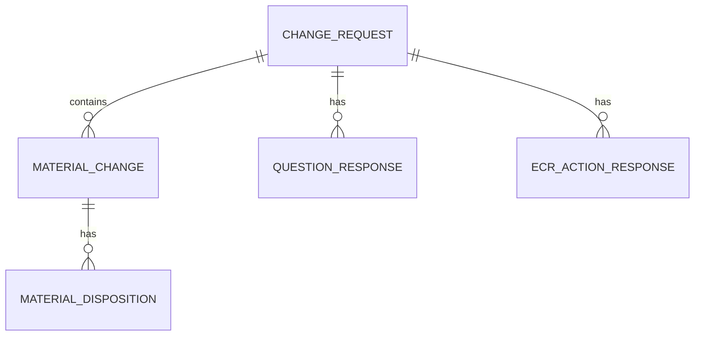
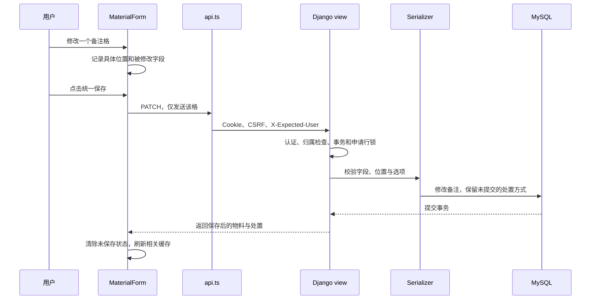

# 项目开发梳理：进度、过程与开发流程

更新日期：2026-10-02。面向需要逐步接手项目的人。本文解释“系统如何工作、为什么这样设计、以后怎么改”，当前状态以 [README](../README.md) 为汇总入口，具体字段以 [字段说明](FIELD_MAP.md) 为准。

## 建议的阅读顺序

1. 先看 README，分清已经实现、尚未实现和待复核的内容。
2. 阅读本文的业务流程、代码地图和保存流程；能顺着一次点击找到数据库写入位置即可。
3. 按 [开发说明](DEVELOPMENT.md) 启动，创建自己的练习草稿，不拿正式样例做删除练习。
4. 对照字段说明与源 Excel，理解一个字段的名称、类型及所属表。
5. 修改功能时查对应代码与测试；遇到某个历史问题，再打开相关验证记录。无需一开始读完全部日志。

## 业务上目前走到了哪里

目标是把指定八张表的内容搬到网页，最终支持多人并行审批和留言；完整目标在 [MVP](MVP.md)。当前“概述与物料处置”“问题评估”和“ECR 评估行动”的主要填写链路已落地，当前版本待业务复核。

当前操作：登录 → 我的申请 → 新建／打开草稿 → 填写概述 → 物料及处置 → 问题评估 → ECR 评估 → 保存 → 重开恢复。

**四个网页页签对应三张 Excel 表。** 概述与物料明细属于同一张原工作表，“问题评估”对应第二张“问题”表，第四页签对应第三张 ECR 表。

原业务主线是概述与物料 → 问题筛查 → ECR 评估 → 执行计划 → ECO 执行确认；EMC 参考和实质性变更评估按适用条件参与。不能把 ECR 评估完成当作 ECO 行动完成，也不能自动代替人的法规结论。

Model 中虽已有 draft／pending／approved 三个状态，但**当前没有提交或批准接口**。网页新建的是草稿；非草稿只读及后端拒绝修改是已有保护，不代表审批功能已经完成。

当前本机样例：申请 #8，ECR-26010601，包含源表概述、33 条停用物料、330 个处置值，以及一次性补录的27题和31条ECR填写。用户后续可以继续修改，原Excel不是实时同步源。新草稿仍为空；没有通用导入功能，样例不会随 Git 克隆到别的设备。

## 先理解五个业务表



| 实际表 | 保存什么 | 为什么分开 |
| --- | --- | --- |
| change_request | 申请者、状态、概述、ECR/ECO 编号及时间 | 一项申请只有一份概述 |
| material_change | 三类物料、料号、版本、描述、分类、标记及变更内容 | 一项申请可以有很多条物料 |
| material_disposition | 物料关联、位置分组、具体位置、处置方式及备注 | 同一物料在不同位置有不同处理方式 |
| question_response | 申请关联、题号、回答和备注 | 固定题干统一配置，每项申请仅保存填写结果 |
| ecr_action_response | 申请、稳定行动标识、负责人、结果、状态及日期 | 一题可对应多条行动，固定文字共用配置，不在申请中重复存储 |

物料／位置组合唯一；三大分组不是三张表。网页的十个位置都能显示，但只有填了处置或备注的位置才需要一条记录；两个格都清空时删除该位置记录。“未填写”和明确选择 NA 是不同数据。

编号和版本用文本保存，避免 `000003151` 变成数字后丢失前导零。ECR 与 ECO 分别全局唯一，空编号允许多个；物料号没有全局唯一规则，不能用它判断一次新增是否重复。

申请删除会通过外键级联删除物料、处置、问题回答及 ECR 填写；只允许本人草稿，操作不可恢复。Django 的用户和会话表属于系统表，和这五个业务表职责不同。

### Model、migration、serializer 各负责什么

- **Model**：数据库里有哪些字段、外键和约束，见 [models.py](../backend/changes/models.py)。
- **migration**：如何把数据库升级成 Model 所描述的结构。只改 Python 文件不会自动给已有数据库加列或建表。
- **serializer**：HTTP 输入是否合法、哪些字段能改、怎样把对象转为 JSON，见 [serializers.py](../backend/changes/serializers.py)。接口校验不能替代数据库唯一约束。
- **view**：谁能访问、申请状态是否允许操作、什么时候开启事务和拿行锁，见 [views.py](../backend/changes/views.py)。

当前迁移链：0001 申请表 → 0002 编号唯一 → 0003 物料表 → 0004 新增请求 UUID → 0005 处置表 → 0006 问题回答表 → 0007 ECR 行动填写表。不同设备必须执行各自的迁移；Git 同步不包含数据库升级。

## 代码地图：想改什么，先找哪里

| 位置 | 入口与职责 |
| --- | --- |
| [frontend/src/main.tsx](../frontend/src/main.tsx) | 启动 React、提供 TanStack Query；当前查询缓存新鲜期 30 秒 |
| [frontend/src/App.tsx](../frontend/src/App.tsx) | Login；Workspace 识别登录状态；UserWorkspace 管理当前账号的列表；ChangeEditor 管理页签与离开提醒；OverviewEditor 编辑概述 |
| [frontend/src/MaterialEditor.tsx](../frontend/src/MaterialEditor.tsx) | 物料列表、筛选、新增／编辑／删除；内部 MaterialForm 管理表单、局部修改及统一保存 |
| [frontend/src/DispositionFields.tsx](../frontend/src/DispositionFields.tsx) | 三组十位置的处置控件，不直接发请求 |
| [frontend/src/QuestionEditor.tsx](../frontend/src/QuestionEditor.tsx) | 七组问题表格、局部保存、基线对比、失败与刷新保护 |
| [frontend/src/EcrEditor.tsx](../frontend/src/EcrEditor.tsx)／[ecrDraft.ts](../frontend/src/ecrDraft.ts) | 正式 ECR 列表与单条抽屉；干净读取更新字段和基线，脏输入与待确认结果保持 |
| [frontend/src/SaveBeforeSwitch.tsx](../frontend/src/SaveBeforeSwitch.tsx) | 保存并切换确认；保存成功才导航，等待时互斥，失败保留当前页 |
| [frontend/src/api.ts](../frontend/src/api.ts) | TypeScript 数据类型、fetch、当前 Cookie 的 CSRF、预期账号头、错误转换和身份变化事件 |
| [backend/backend/urls.py](../backend/backend/urls.py) | URL 对应哪个处理函数或 view |
| [backend/backend/settings.py](../backend/backend/settings.py) | MySQL、SessionAuthentication、默认权限、本机环境变量 |
| [backend/changes/permissions.py](../backend/changes/permissions.py) | 检查页面预期账号与当前认证账号是否一致；不授予额外权限 |
| [backend/changes/dispositions.py](../backend/changes/dispositions.py) | 后端固定位置和处置选项 |
| [backend/changes/questions.py](../backend/changes/questions.py) | 后端固定题号、题干、职能和条件性理由提示 |
| [backend/changes/ecr_actions.json](../backend/changes/ecr_actions.json)／[ecr.py](../backend/changes/ecr.py) | 61 条固定行动、来源问题和职能；后端与演示共用定义 |
| [backend/changes/signals.py](../backend/changes/signals.py) | 登录后使同账号的旧数据库会话失效；由 apps.py 注册 |
| [scripts/backend.ps1](../scripts/backend.ps1) | 加载本机配置并调用 manage.py，启动或执行检查 |

目前没有前端路由框架：页签与选中申请由 React 状态管理，刷新通常回到“我的申请”。也没有通用动态表单平台、规则引擎或独立审批服务。

## 一次保存怎样到达数据库

以“把公司库存成品的备注清空，但保留 NA”为例：



开发时由 Vite 把 `/api` 请求代理到 Django，本机为 8001，共享默认 8000。代理配置仅用于开发；正式部署尚未验收。

传输示例：

```json
{"dispositions":{"company_finished":{"remark":""}}}
```

空字符串表示清空；没有提交的 `disposition` 和其他位置保持不变。不能把整份旧表单重新发送，否则可能覆盖另一个窗口刚保存的字段。基础物料与处置在一个事务内保存，后半段失败时前半段也回滚。

### 三个容易混淆的保护

| 机制 | 解决的问题 | 不解决什么 |
| --- | --- | --- |
| 认证及所属申请过滤 | 当前登录用户只能访问自己的申请 | 不能单凭缓存知道另一个窗口刚换了账号 |
| X-Expected-User | 当前 Cookie 账号和页面预期账号不同就拒绝操作、刷新身份 | 该头不是密码或授权凭据，旧客户端未传时保留原认证行为 |
| UUID request_id | 同一新增抽屉失败重试返回原记录，不重复建行 | 不按料号去重；不能代替业务编号规则 |

同一个 UUID 重试的内容如果不同，后端返回 409，不静默覆盖原记录。读取物料和处置也使用申请行锁，避免两次查询间插入保存而混合不同版本。

同一字段同时修改仍以后保存为准，没有版本冲突检测；不同字段通过局部 PATCH 尽量保留。失败保留输入是前端状态保护，不是自动保存到数据库。

也要区分三种数据位置：Form／React state 是正在填写的内容，TanStack Query 缓存是最近读到的服务器结果，MySQL 才是持久化数据。刷新会重新建立前端状态，需要重开申请读取数据库；未保存提醒不是备份。有时服务器已经保存但响应丢失，因此新增不能只靠“再次点击保存”，还需要稳定 UUID 防止重复建行。

## 开发过程：每一批解决了什么

下表是过程索引，不重复完整测试日志；日期按本项目记录的批次划分。

| 批次 | 实质交付或发现 | 原因与证据入口 |
| --- | --- | --- |
| 概述草稿及编号规则 | 登录、概述保存恢复、单会话、编号约束 | 先做能独立验证的一小段；[阶段一记录](testing/REVIEW-2026-09-30.md) |
| 三类物料 | 列表＋单条抽屉，基础物料保存恢复 | 库存处置明确另做，不能说整张表完成；[物料记录](testing/MATERIALS-2026-10-01.md) |
| 早期审查修复 | 后台读取失败丢输入、会话失效、换账号缓存、重复新增 | 保存成功响应丢失不等于服务器未保存；同账号重登要保留草稿 |
| 草稿删除及布局对照 | 草稿级联删除，处置 A/B 内存原型 | 先验证使用方式，再由用户选定同一抽屉布局；[删除及对照记录](testing/DELETION-AB-2026-10-01.md) |
| 正式处置接入 | 建处置表，统一保存，原型退出正式流程 | 布局选择不是持久化完成；[处置记录](testing/DISPOSITIONS-2026-10-01.md) |
| 本机 Excel 补录 | #8 的 33 条停用物料与 330 个处置值 | 保留原表文字和前导零，不修改概述或其他申请，不开发通用导入 |
| 深入审查修复 | 旧窗口写入错误账号、混合版本读取、嵌套错误乱码式展示 | 后端检查预期账号；读取也串行；递归错误保留路径；[修复记录](testing/REVIEW-FIXES-2026-10-02.md) |
| 测试精简 | 53 个方法合为 51 个，复用公共用户、仅测试快速哈希 | 保留业务断言，减少准备成本；[计时对照](testing/TEST-SIMPLIFICATION-2026-10-02.md) |
| GitHub 合并 | 功能提交 356d590；PR #1 合并提交 3f62f00 | main 已含上述代码；合并不代表数据库同步、业务验收或生产部署 |
| 问题评估 | 27 题、七个职能分组、局部保存恢复及条件提示 | 第 13 题保留综合回答，理由缺失不阻断草稿；[问题页验证](testing/QUESTIONS-2026-10-02.md)；分支交付及 main 合并状态见 README |
| ECR 布局选择及接入 | A/B 比较后选 A，加入真实数据库与第四页签 | 布局选择和数据库接入分别验证；[预览历史](testing/ECR-PREVIEW-2026-10-02.md)、[正式接入](testing/ECR-INTEGRATION-2026-10-02.md) |
| 两页源表补录与筛选调整 | #8 补录27题与31条ECR；默认仅当前触发 | 未触发时隐藏但保留内容，全部行动仍可查看；日期／状态保留源含义 |
| 保存导航与顶部保存 | 概述／问题页保存并切换；问题页顶部保存 | 不增加自动保存；[导航验证](testing/SAVE-AND-SWITCH-2026-10-02.md) |
| ECR 抽屉刷新修复 | 干净抽屉与列表一致，脏表单保留原基线 | 部分更新不把旧负责人误当成修改；[刷新验证](testing/ECR-DRAWER-REFRESH-2026-10-02.md) |

历史日志中各批测试数量都是当时结果，不是互相矛盾。当前计数以 README 为准；问题页新增10项后端测试，ECR新增7项，当前后端68项、前端12项。

## 日常开发流程：一次只完成一小批

1. **先定边界**：写清用户要新增什么、什么不做、怎样验证。避免“顺便把剩下 MVP 全补齐”。
2. **核对原表与现有代码**：题目、字段、合并单元格、条件规则及已有数据分别检查，不直接复制样例作为默认值。
3. **确定数据与接口**：哪些是业务字段，哪些由系统控制；空白与否／NA 是否不同；唯一性、归属和删除关系是什么。
4. **实现后端与迁移**：先处理输入校验、权限、事务及约束；迁移前保留设备配置、备份并停写，具体命令只维护在开发说明。
5. **实现页面闭环**：填写 → 保存 → 重开；同时处理未保存离开、失败保留输入、请求期间互斥和缓存刷新。
6. **按影响验证**：先运行受影响测试，再做针对性页面回归；一批交付／合并前跑全量。真实 MySQL、静态检查和浏览器验证不能互相冒充。
7. **审查并修复**：用独立测试账号复现，不操作真实样例；必须区分产品问题与自动化工具的动画／定位问题。
8. **更新文档、提交与合并**：README 更新现状，字段说明更新映射，验证记录保存独有证据；按用户授权提交／推送／合并，不上传凭据或数据库。

运行方法统一见 [开发说明](DEVELOPMENT.md)。当前测试在独立 `test_form_system` 中运行后销毁，不在开发库上做破坏性测试；MD5 快速哈希只覆盖功能测试类，生产仍使用默认强哈希。

### 自己读懂项目的三个练习

- **追一个字段**：在副本草稿修改标题，依次找到 OverviewEditor、api.ts、ChangeDetail、ChangeRequestSerializer、ChangeRequest.title，解释每一层做了什么。
- **追一个处置格**：只清空备注，在浏览器 Network 看 PATCH 是否只含 remark，再解释为什么 NA 没有被覆盖。
- **追一个拒绝**：用另一个独立测试账号请求不属于自己的申请，核对状态码；不要只看前端按钮是否隐藏。

出现问题先记录申请 ID、操作顺序、预期／实际结果和 HTTP 状态。查看请求时不要把 Cookie、密码或本机配置贴入公开 PR。

## 问题评估（已实现，待业务复核）

本批已实现闭环：打开申请 → 回答 27 题并填备注 → 保存 → 刷新／重开／重登恢复。技术验证见 [验证记录](testing/QUESTIONS-2026-10-02.md)，人工复核待完成。

| 内容 | 实现边界 |
| --- | --- |
| 固定内容 | 按原 Excel 职能分组显示题号和完整题干；不引入动态表单框架 |
| 可填写内容 | 未回答／是／否和备注；未回答不能自动转成否；草稿可暂不填完整 |
| 条件提示 | 第 5、13、14 题选否且备注为空时提示说明理由，允许保存草稿；第 13 题不拆分 |
| 数据设计 | 沿用原设计的 question_response，与申请关联；题号、回答、备注，同申请／题号唯一；题干与职能固定配置，不逐申请重复存储 |
| 导航 | 物料下一页到问题，问题上一页／下一页连接物料及真实ECR；概述和问题可保存并切换，问题顶部及底部都能保存 |
| 保护 | 沿用预期账号、本人申请、非草稿只读、局部保存、申请锁、级联删除及失败保留输入 |
| 不做 | ECR/ECO 行动生成、执行计划、EMC／F 页面、审批、留言、导出、模板版本及通用规则引擎 |

27 个稳定题号、题干、职能及提示映射已直接对照源表；新申请全部未回答，原实例的“否”与备注不是默认值。原表位置及接口结构见 [字段说明](FIELD_MAP.md#问题表已实现待业务复核)。

页面只发送与已保存基线不同的题和字段，改回原值不再标记未保存。读取刷新不覆盖脏表单，较旧的读取结果也不能覆盖新保存的基线。同账号重登刷新问题缓存但保留输入，切换账号关闭原编辑器；申请删除时移除问题缓存。失败或 404 保留输入，不自动创建替代申请。没有自动保存或并发版本冲突处理。

验收点：题目完整、三种回答状态有区别、备注正确恢复、单题改动不覆盖其他题、其他账号不能访问、非草稿不能修改、失败保留输入。27 题不需要机械增加 27 个测试方法，可用一项完整性检查加有意义的参数化场景；独立的权限／事务回归不能因此删除。

ECR 已按选定的 A 版正式接入，技术验证见 [接入记录](testing/ECR-INTEGRATION-2026-10-02.md)，用户业务复核待完成；之后再单独规划 ECO。不要把问题回答为否直接解释成删除已填行动。

## ECR 当前规则与后续待办

正式页只使用已保存的问题答案。默认“当前触发”仅显示回答是的行动，否／未回答隐藏，不删除填写；全部行动可查看和编辑。每条固定行动有独立稳定标识，一题对应多条，不能按题号去重。负责人是业务文字，评估结果、完成／不适用状态及日期由人填写，不自动执行题干中的审批或法规步骤。

干净抽屉在重登／读取刷新后同步最新字段及基线；未保存、保存中、结果未确认时保持输入和原基线。源表补录不属于通用导入。独立预览仍是内存演示，正式登录后的第四页签才会写数据库。

先复核当前ECR联动、源字段和保存恢复，再分批规划ECO及其余工作表。自动保存已列入README待办，仍未启用；实施前确定页面范围、保存时机、请求串行、错误重试及联动时机，不将未保存提醒当作异常退出恢复。

## 以后怎样维护这些文档

- README 只更新当前汇总，不再连续追加每一轮耗时和修复全文。
- 本文追加重要交付及设计变化；细节已有证据链接时不再次复制日志。
- DEVELOPMENT 维护可执行步骤，FIELD_MAP 维护源字段，MVP 维护总体需求；修改一项事实时先确定应由哪个文件负责。
- testing 下的记录是历史证据：保留独有复现、迁移、计时和限制，不因历史数字不同而删掉。新结论更新汇总并指向新记录。
- 问题清单要区分“已实现／已验证／待人工复核／待开发”；代码合并不能自动关闭业务验收。
