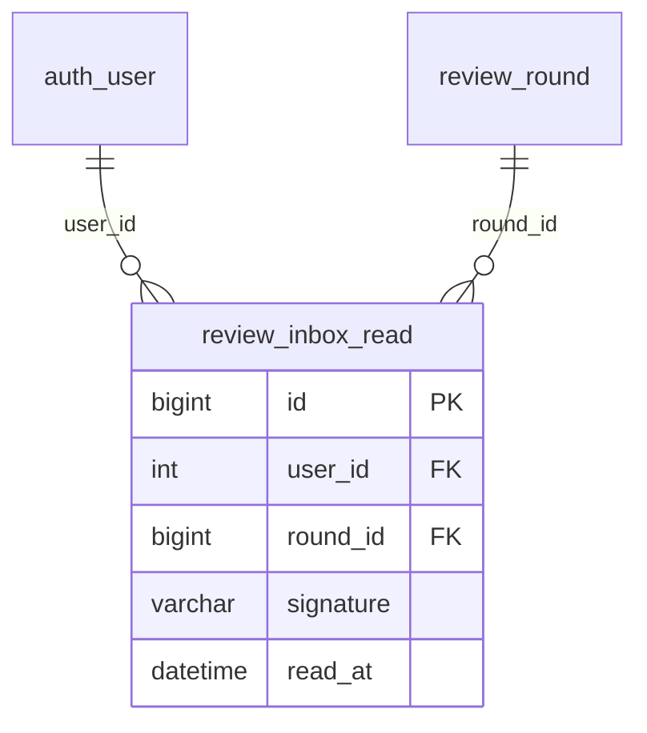

# 数据库字段 ER 图（0015快照及0016／0017补充）

原图生成日期：2026-10-08，记录0015时本机MySQL的21张业务表。2026-10-09当前迁移已至0017，共23张业务表；0016新增review_inbox_read，0017新增system_feedback_read及沟通事件kind，见下方补充。原图保留其快照含义，不再将21张称作当前总量。

包含全部实际列（含隐式主键、外键列、UUID、时间、JSON及存储生成列）。不包含 Django 用户、会话、权限及迁移等系统表。用户外键在字段注释中注明目标表。

PK为主键，FK为外键，UK仅表示单列唯一；联合唯一单独列在图后。SQL类型采用本机数据库实际类型，NOT NULL和NULL允许指数据库可空性，NOT NULL文字字段仍可能允许空字符串。创建和更新时间由Django处理，不表示数据库触发器或自动更新时间约束。

关系线标签是实际外键列名；可空外键用零或一个，必填外键用恰好一个。实体之间均使用实线，未进一步区分识别与非识别关系。

```mermaid
erDiagram
    direction TB

    %% 变更申请
    change_request {
        bigint id PK "NOT NULL；自增"
        varchar(16) status "NOT NULL"
        varchar(255) title "NOT NULL"
        varchar(64) ecr_no "NOT NULL"
        varchar(64) eco_no "NOT NULL"
        longtext affected_products "NOT NULL"
        varchar(255) affected_region "NOT NULL"
        varchar(255) initiating_factory "NOT NULL"
        longtext affected_factories "NOT NULL"
        varchar(255) ccb_owner "NOT NULL"
        varchar(255) change_owner "NOT NULL"
        date planned_eco_date "NULL允许"
        longtext change_reason "NOT NULL"
        datetime(6) created_at "NOT NULL；创建时自动填写"
        datetime(6) updated_at "NOT NULL；保存时自动更新"
        int applicant_id FK "关联 auth_user；NOT NULL"
        varchar(64) eco_no_unique UK "存储生成列：空编号转NULL；NULL允许"
        varchar(64) ecr_no_unique UK "存储生成列：空编号转NULL；NULL允许"
        varchar(16) review_mode "NOT NULL"
        datetime(6) submitted_at "NULL允许"
        int_unsigned current_review_round "NOT NULL"
    }

    %% 物料变更
    material_change {
        bigint id PK "NOT NULL；自增"
        varchar(20) category "NOT NULL"
        varchar(255) material_no "NOT NULL"
        longtext description "NOT NULL"
        varchar(255) material_class "NOT NULL"
        varchar(1) spare_part "NOT NULL"
        varchar(1) optional_part "NOT NULL"
        varchar(255) old_revision "NOT NULL"
        varchar(255) new_revision "NOT NULL"
        varchar(255) revision "NOT NULL"
        varchar(255) detailed_class "NOT NULL"
        varchar(255) discontinued_project "NOT NULL"
        longtext change_description "NOT NULL"
        bigint change_id FK "关联 change_request；NOT NULL"
        char(32) request_id "UUID；NULL允许"
    }

    %% 物料位置处置
    material_disposition {
        bigint id PK "NOT NULL；自增"
        varchar(16) location_group "NOT NULL"
        varchar(32) location_item "NOT NULL"
        varchar(20) disposition "NOT NULL"
        longtext remark "NOT NULL"
        bigint material_id FK "关联 material_change；NOT NULL"
    }

    %% 问题回答
    question_response {
        bigint id PK "NOT NULL；自增"
        smallint_unsigned number "NOT NULL"
        varchar(1) answer "NOT NULL"
        longtext remark "NOT NULL"
        bigint change_id FK "关联 change_request；NOT NULL"
    }

    %% ECR评估行动
    ecr_action_response {
        bigint id PK "NOT NULL；自增"
        varchar(7) action_key "NOT NULL"
        varchar(255) owner "NOT NULL"
        longtext result "NOT NULL"
        varchar(16) status "NOT NULL"
        date date "NULL允许"
        bigint change_id FK "关联 change_request；NOT NULL"
    }

    %% ECO执行行动
    eco_action_response {
        bigint id PK "NOT NULL；自增"
        varchar(7) action_key "NOT NULL"
        varchar(255) owner "NOT NULL"
        longtext result "NOT NULL"
        varchar(24) status "NOT NULL"
        date date "NULL允许"
        bigint change_id FK "关联 change_request；NOT NULL"
    }

    %% 执行计划
    execution_plan_response {
        bigint id PK "NOT NULL；自增"
        varchar(8) activity_key "NOT NULL"
        varchar(255) owner "NOT NULL"
        date start_date "NULL允许"
        date end_date "NULL允许"
        longtext remark "NOT NULL"
        bigint change_id FK "关联 change_request；NOT NULL"
    }

    %% 实质性最终评估
    significant_assessment {
        bigint id PK "NOT NULL；自增"
        varchar(24) f_assessment "NOT NULL"
        varchar(16) final_conclusion "NOT NULL"
        bigint change_id FK, UK "关联 change_request；NOT NULL"
    }

    %% 实质性分组评估
    significant_chart_response {
        bigint id PK "NOT NULL；自增"
        varchar(1) chart_key "NOT NULL"
        varchar(1) applicability "NOT NULL"
        longtext reason "NOT NULL"
        varchar(16) result "NOT NULL"
        bigint change_id FK "关联 change_request；NOT NULL"
    }

    %% 实质性逐题回答
    significant_question_response {
        bigint id PK "NOT NULL；自增"
        varchar(16) question_key "NOT NULL"
        varchar(1) answer "NOT NULL"
        longtext reason "NOT NULL"
        bigint change_id FK "关联 change_request；NOT NULL"
    }

    %% EMC参考副本
    emc_reference {
        bigint id PK "NOT NULL；自增"
        varchar(255) title "NOT NULL"
        longtext introduction "NOT NULL"
        longtext legend "NOT NULL"
        longtext definitions "NOT NULL"
        datetime(6) created_at "NOT NULL；创建时自动填写"
        datetime(6) updated_at "NOT NULL；保存时自动更新"
        bigint change_id FK, UK "关联 change_request；NOT NULL"
    }

    %% EMC典型变更行
    emc_reference_row {
        bigint id PK "NOT NULL；自增"
        varchar(64) key "NOT NULL"
        longtext label "NOT NULL"
        int_unsigned sort_order "NOT NULL"
        bigint reference_id FK "关联 emc_reference；NOT NULL"
    }

    %% EMC测试列
    emc_reference_test {
        bigint id PK "NOT NULL；自增"
        varchar(64) key "NOT NULL"
        longtext label "NOT NULL"
        varchar(255) group_label "NOT NULL"
        varchar(255) standard_reference "NOT NULL"
        int_unsigned sort_order "NOT NULL"
        bigint reference_id FK "关联 emc_reference；NOT NULL"
    }

    %% EMC填写格
    emc_reference_cell {
        bigint id PK "NOT NULL；自增"
        varchar(3) mark "NOT NULL"
        longtext remark "NOT NULL"
        bigint reference_id FK "关联 emc_reference；NOT NULL"
        bigint row_id FK "关联 emc_reference_row；NOT NULL"
        bigint test_id FK "关联 emc_reference_test；NOT NULL"
    }

    %% 审核轮次
    review_round {
        bigint id PK "NOT NULL；自增"
        int_unsigned number "NOT NULL"
        varchar(16) review_mode "NOT NULL"
        char(32) request_id "UUID；NULL允许"
        varchar(255) title "NOT NULL"
        varchar(64) ecr_no "NOT NULL"
        varchar(64) eco_no "NOT NULL"
        datetime(6) submitted_at "NOT NULL"
        varchar(16) state "NOT NULL"
        datetime(6) approved_at "NULL允许"
        datetime(6) returned_at "NULL允许"
        longtext return_reason "NOT NULL"
        bigint change_id FK "关联 change_request；NOT NULL"
        int returned_by_id FK "关联 auth_user；NULL允许"
    }

    %% 个人审核记录
    review_record {
        bigint id PK "NOT NULL；自增"
        datetime(6) approved_at "NULL允许"
        bigint change_id FK "关联 change_request；NOT NULL"
        int reviewer_id FK "关联 auth_user；NOT NULL"
        tinyint(1) assigned "NOT NULL"
        bigint round_id FK "关联 review_round；NULL允许"
    }

    %% 旧普通留言
    review_feedback {
        bigint id PK "NOT NULL；自增"
        char(32) request_id "UUID；NOT NULL"
        longtext text "NOT NULL"
        datetime(6) created_at "NOT NULL；创建时自动填写"
        int author_id FK "关联 auth_user；NOT NULL"
        bigint round_id FK "关联 review_round；NOT NULL"
    }

    %% 审核修改意见
    review_issue {
        bigint id PK "NOT NULL；自增"
        varchar(32) tab "NOT NULL"
        varchar(255) location "NOT NULL"
        longtext text "NOT NULL"
        varchar(16) state "NOT NULL"
        int_unsigned version "NOT NULL"
        datetime(6) created_at "NOT NULL；创建时自动填写"
        int author_id FK "关联 auth_user；NOT NULL"
        bigint change_id FK "关联 change_request；NOT NULL"
        bigint source_round_id FK "关联 review_round；NOT NULL"
    }

    %% 意见处理事件
    review_issue_event {
        bigint id PK "NOT NULL；自增"
        varchar(16) kind "NOT NULL"
        longtext text "NOT NULL"
        varchar(16) state "NOT NULL"
        int_unsigned version "NOT NULL"
        char(32) request_id "UUID；NOT NULL"
        int_unsigned position "NOT NULL"
        json payload "NOT NULL"
        datetime(6) created_at "NOT NULL；创建时自动填写"
        int author_id FK "关联 auth_user；NOT NULL"
        bigint change_id FK "关联 change_request；NOT NULL"
        bigint issue_id FK "关联 review_issue；NULL允许"
        bigint round_id FK "关联 review_round；NOT NULL"
    }

    %% 独立系统反馈
    system_feedback {
        bigint id PK "NOT NULL；自增"
        varchar(16) category "NOT NULL"
        longtext content "NOT NULL"
        varchar(16) status "NOT NULL"
        char(32) request_id "UUID；NOT NULL"
        int_unsigned version "NOT NULL"
        datetime(6) created_at "NOT NULL；创建时自动填写"
        datetime(6) updated_at "NOT NULL；保存时自动更新"
        int submitter_id FK "关联 auth_user；NOT NULL"
    }

    %% 系统反馈处理记录
    system_feedback_event {
        bigint id PK "NOT NULL；自增"
        longtext text "NOT NULL"
        varchar(16) from_status "NOT NULL"
        varchar(16) to_status "NOT NULL"
        char(32) request_id "UUID；NOT NULL"
        int_unsigned base_version "NOT NULL"
        datetime(6) created_at "NOT NULL；创建时自动填写"
        int actor_id FK "关联 auth_user；NOT NULL"
        bigint feedback_id FK "关联 system_feedback；NOT NULL"
    }

    %% 全部业务表间外键；用户外键已在字段中注明，系统用户表不计入21张业务表
    change_request ||--o{ material_change : "change_id"
    material_change ||--o{ material_disposition : "material_id"
    change_request ||--o{ question_response : "change_id"
    change_request ||--o{ ecr_action_response : "change_id"
    change_request ||--o{ eco_action_response : "change_id"
    change_request ||--o{ execution_plan_response : "change_id"
    change_request ||--o| significant_assessment : "change_id"
    change_request ||--o{ significant_chart_response : "change_id"
    change_request ||--o{ significant_question_response : "change_id"
    change_request ||--o| emc_reference : "change_id"
    emc_reference ||--o{ emc_reference_row : "reference_id"
    emc_reference ||--o{ emc_reference_test : "reference_id"
    emc_reference ||--o{ emc_reference_cell : "reference_id"
    emc_reference_row ||--o{ emc_reference_cell : "row_id"
    emc_reference_test ||--o{ emc_reference_cell : "test_id"
    change_request ||--o{ review_round : "change_id"
    change_request ||--o{ review_record : "change_id"
    review_round |o--o{ review_record : "round_id"
    review_round ||--o{ review_feedback : "round_id"
    change_request ||--o{ review_issue : "change_id"
    review_round ||--o{ review_issue : "source_round_id"
    change_request ||--o{ review_issue_event : "change_id"
    review_issue |o--o{ review_issue_event : "issue_id"
    review_round ||--o{ review_issue_event : "round_id"
    system_feedback ||--o{ system_feedback_event : "feedback_id"
```

## 联合唯一约束

- `material_change`：`(change_id, request_id)` 联合唯一。
- `material_disposition`：`(material_id, location_item)` 联合唯一。
- `question_response`：`(change_id, number)` 联合唯一。
- `ecr_action_response`：`(change_id, action_key)` 联合唯一。
- `eco_action_response`：`(change_id, action_key)` 联合唯一。
- `execution_plan_response`：`(change_id, activity_key)` 联合唯一。
- `significant_chart_response`：`(change_id, chart_key)` 联合唯一。
- `significant_question_response`：`(change_id, question_key)` 联合唯一。
- `emc_reference_row`：`(reference_id, id)` 联合唯一。
- `emc_reference_row`：`(reference_id, key)` 联合唯一。
- `emc_reference_test`：`(reference_id, id)` 联合唯一。
- `emc_reference_test`：`(reference_id, key)` 联合唯一。
- `emc_reference_cell`：`(row_id, test_id)` 联合唯一。
- `review_round`：`(change_id, number)` 联合唯一。
- `review_round`：`(change_id, request_id)` 联合唯一。
- `review_record`：`(round_id, reviewer_id)` 联合唯一。
- `review_feedback`：`(round_id, author_id, request_id)` 联合唯一。
- `review_issue_event`：`(change_id, author_id, request_id, position)` 联合唯一。
- `system_feedback`：`(submitter_id, request_id)` 联合唯一。
- `system_feedback_event`：`(feedback_id, request_id)` 联合唯一。

## 0016已读表补充

`review_inbox_read`保存id（PK）、user_id（FK至auth_user）、round_id（FK至review_round）、signature（64字符消息批签名）、read_at（已读时间）。`(user_id, round_id)`联合唯一；用户或轮次删除时级联删除。它只记录提醒状态，不修改申请、意见或批准结果。字段依据当前models.py及0016迁移，0016阶段原图的21张表另加此表共22张；0017另增下述反馈已读表。

## 0017反馈沟通与已读补充

system_feedback_event新增kind（varchar(16)），manager为管理员处理，followup为用户追加；历史事件回填manager。system_feedback_read保存id（PK）、user_id（FK至auth_user）、feedback_id（FK至system_feedback）、version（unsigned int，已读入站消息版本），用户／反馈联合唯一；用户或反馈删除时级联删除。原21表加两张已读表即为当前23张。

## EMC复合外键

`emc_reference_cell(reference_id, row_id)` 关联 `emc_reference_row(reference_id, id)`；`emc_reference_cell(reference_id, test_id)` 关联 `emc_reference_test(reference_id, id)`，约束填写格与行、列属于同一份参考。图中对应普通外键线已展示，不重复画线。
