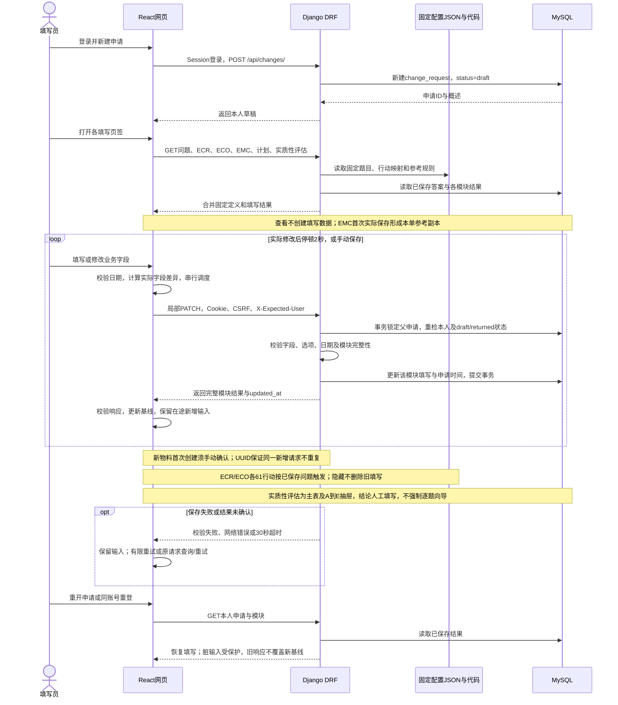
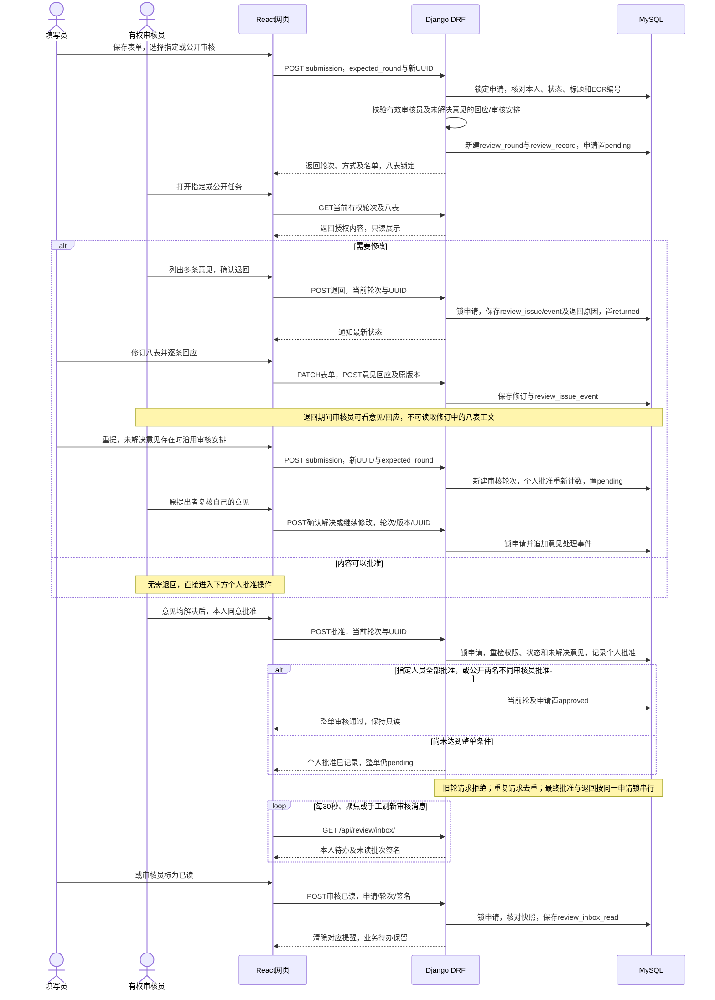
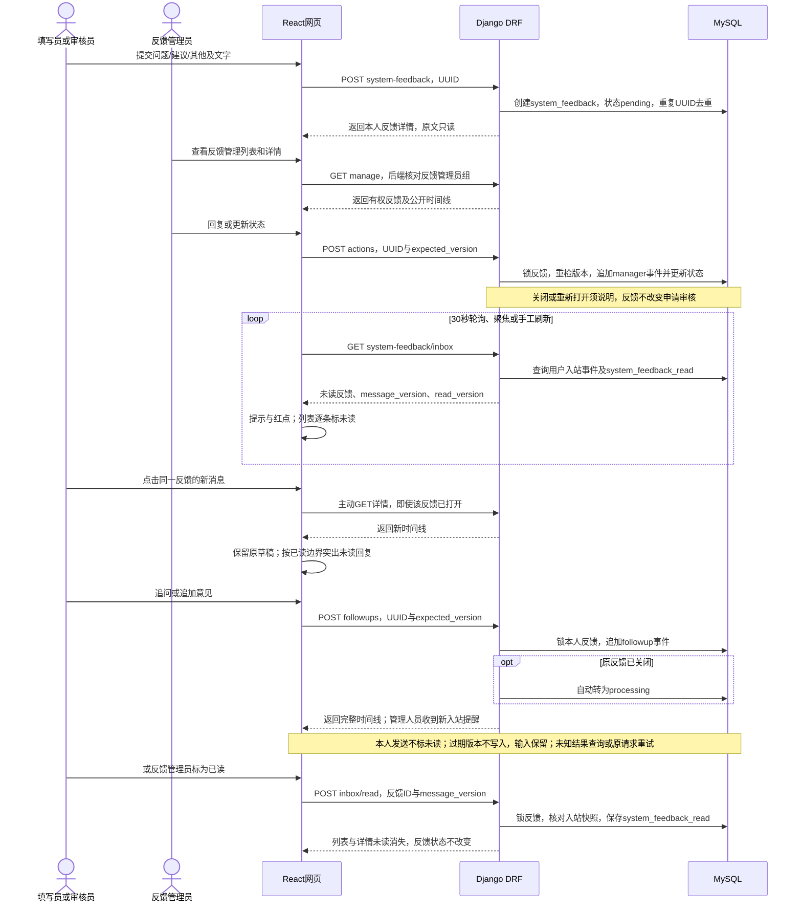
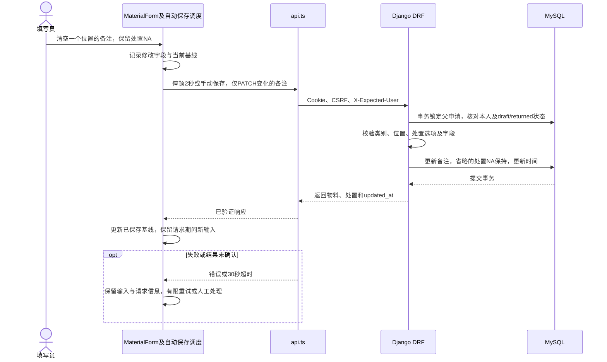

# 当前项目序列图（2026-10-09）

依据当前React、Django DRF及MySQL实现更新。原方案图片仅作历史参考；以下图描述已实现功能，不加入规则维护、导入导出或未确认流程。

## 原图核对

- 原图数据库PostgreSQL与当前MySQL不一致。
- action_response、execution_plan_item、significant_response及change_request.significant_conclusion等旧表/字段不对应当前结构。
- 当前实质性评估为主表加A到E抽屉及人工结论，不是强制逐题向导。
- 补充2秒自动保存、局部PATCH、在途输入保护、提交锁定、按轮审核、退回重提、正式意见、系统反馈追问和两套持久已读。
- PROJECT_GUIDE中的单格保存图补入自动保存，并避免把在途输入一律清空。

## 基础填报、保存与恢复

[Mermaid源文件](SEQUENCE-FILL-SAVE.mmd) · [SVG](images/SEQUENCE-FILL-SAVE.svg) · [PNG](images/SEQUENCE-FILL-SAVE.png)

## 提交审核、意见与退回重提

[Mermaid源文件](SEQUENCE-REVIEW.mmd) · [SVG](images/SEQUENCE-REVIEW.svg) · [PNG](images/SEQUENCE-REVIEW.png)

## 系统反馈、追加意见与未读

[Mermaid源文件](SEQUENCE-FEEDBACK.mmd) · [SVG](images/SEQUENCE-FEEDBACK.svg) · [PNG](images/SEQUENCE-FEEDBACK.png)

## 单格物料保存

[Mermaid源文件](SEQUENCE-MATERIAL-SAVE.mmd) · [SVG](images/SEQUENCE-MATERIAL-SAVE.svg) · [PNG](images/SEQUENCE-MATERIAL-SAVE.png)
